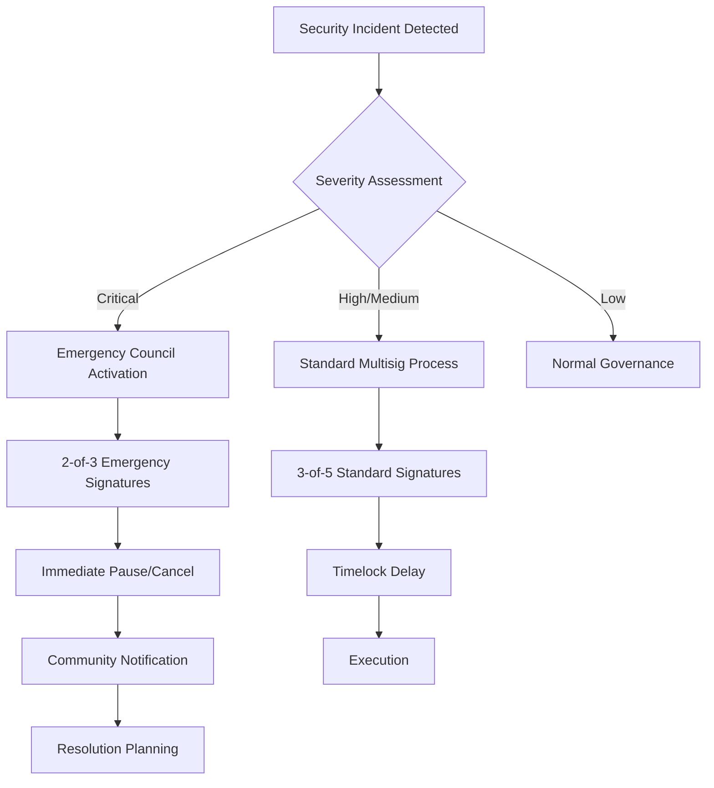

# Treasury Timelock Security Configuration

## 🎯 Executive Summary

This document defines production-ready security configurations for the CIRO Network Treasury Timelock contract, based on comprehensive integration testing and security best practices.

## 🔒 Core Security Parameters

### **Timelock Delays (Production Recommendations)**

| Operation Type | Recommended Delay | Rationale |
|---|---|---|
| **Standard Treasury Operations** | 48 hours (172,800 seconds) | Allows community review and emergency response |
| **Critical Parameter Changes** | 72 hours (259,200 seconds) | Extra time for high-impact changes |
| **Emergency Operations** | 24 hours (86,400 seconds) | Balance between security and response speed |
| **Routine Maintenance** | 24 hours (86,400 seconds) | Standard operational window |

### **Multi-signature Configuration**

| Role | Recommended Setup | Security Level |
|---|---|---|
| **Standard Operations** | 3-of-5 multisig | High security with operational flexibility |
| **Emergency Council** | 2-of-3 multisig | Rapid response capability |
| **Admin Functions** | Single admin with 4-of-7 override | Administrative efficiency with community protection |

## 🛡️ Security Model Architecture

### **Three-Tier Security Framework**

```
┌─────────────────────────────────────────┐
│                TIER 1                   │
│           Emergency Council             │
│         (2-of-3 signatures)             │
│                                         │
│  • Pause all operations                 │
│  • Cancel malicious transactions        │
│  • Emergency unpause (with delay)       │
└─────────────────────────────────────────┘
                    ↓
┌─────────────────────────────────────────┐
│                TIER 2                   │
│            Standard Multisig            │
│         (3-of-5 signatures)             │
│                                         │
│  • Treasury fund transfers              │
│  • Parameter adjustments               │
│  • Member management                   │
└─────────────────────────────────────────┘
                    ↓
┌─────────────────────────────────────────┐
│                TIER 3                   │
│             Admin Override              │
│         (4-of-7 signatures)             │
│                                         │
│  • Override emergency pauses           │
│  • System-wide configuration changes   │
│  • Upgrade authorizations              │
└─────────────────────────────────────────┘
```

## 🔧 Production Configuration Parameters

### **Primary Deployment Configuration**

```bash
# Treasury Timelock Production Deployment
ADMIN_ADDRESS="0x02f5248a6b08cd6a52cb9db812e98c675be165cf803a56ac06aefbce74d1f2ca"
MULTISIG_THRESHOLD=3
TIMELOCK_DELAY=172800  # 48 hours
EMERGENCY_THRESHOLD=2

# Multisig Members (5 total for 3-of-5)
MULTISIG_MEMBERS=(
    "0x02f5248a6b08cd6a52cb9db812e98c675be165cf803a56ac06aefbce74d1f2ca"  # Admin
    "0x076aa95e263cb7f4ccabf4f6eff1cfdb04bd9d5d37da4484d1ace0cfeb822b8c"  # Member 1
    "0x023e82c4a0e9f8c4e0895f35979c78c9ebeeae57bb6503368da6ac19810fddcc"  # Member 2
    "0x[MEMBER_3_ADDRESS]"  # To be provided - Community Representative
    "0x[MEMBER_4_ADDRESS]"  # To be provided - Technical Lead
)

# Emergency Members (3 total for 2-of-3)
EMERGENCY_MEMBERS=(
    "0x02f5248a6b08cd6a52cb9db812e98c675be165cf803a56ac06aefbce74d1f2ca"  # Admin
    "0x076aa95e263cb7f4ccabf4f6eff1cfdb04bd9d5d37da4484d1ace0cfeb822b8c"  # Emergency 1
    "0x[EMERGENCY_2_ADDRESS]"  # To be provided - Security Officer
)
```

### **Security Validation Checklist**

- ✅ **Multi-signature Redundancy**: No single point of failure
- ✅ **Timelock Protection**: Sufficient delay for community review
- ✅ **Emergency Controls**: Rapid response to security incidents
- ✅ **Role Separation**: Clear distinction between operational roles
- ✅ **Upgrade Path**: Secure mechanism for future improvements

## 🚨 Emergency Response Procedures

### **Incident Classification**

| Severity | Response Time | Required Signatures | Actions Available |
|---|---|---|---|
| **CRITICAL** | Immediate | 2-of-3 Emergency | Full system pause, transaction cancellation |
| **HIGH** | 4 hours | 3-of-5 Standard | Selective pausing, parameter adjustment |
| **MEDIUM** | 24 hours | 3-of-5 Standard | Standard timelock procedures |
| **LOW** | 48+ hours | 3-of-5 Standard | Normal governance process |

### **Emergency Response Workflow**



## 🔐 Key Management Strategy

### **Hardware Security Module (HSM) Requirements**

| Role | HSM Requirement | Backup Strategy |
|---|---|---|
| **Admin** | Required | Geographic distribution |
| **Multisig Members** | Recommended | Secure backup locations |
| **Emergency Council** | Required | 24/7 availability |

### **Key Rotation Policy**

- **Regular Rotation**: Every 6 months for active keys
- **Emergency Rotation**: Within 24 hours if compromise suspected
- **Succession Planning**: Clear key transfer procedures
- **Audit Trail**: All key operations logged and monitored

## 📊 Security Monitoring & Alerting

### **Real-time Monitoring**

```bash
# Key Metrics to Monitor
- Transaction proposal frequency
- Approval patterns and timing
- Emergency function usage
- Failed authentication attempts
- Unusual parameter changes
- Gas usage anomalies
```

### **Alert Thresholds**

| Metric | Warning Threshold | Critical Threshold |
|---|---|---|
| **Proposed Transactions** | >5 per day | >10 per day |
| **Emergency Pauses** | >1 per week | >1 per day |
| **Failed Approvals** | >10 per day | >20 per day |
| **Large Value Transfers** | >100K CIRO | >1M CIRO |

## 🛠️ Configuration Testing Strategy

### **Pre-deployment Validation**

1. **Security Parameter Testing**
   - Verify timelock delays function correctly
   - Test multi-signature threshold enforcement
   - Validate emergency controls

2. **Access Control Testing**
   - Test unauthorized access rejection
   - Verify role-based permissions
   - Test member addition/removal

3. **Emergency Scenario Testing**
   - Simulate security incidents
   - Test emergency pause/unpause
   - Verify transaction cancellation

### **Post-deployment Monitoring**

1. **Operational Metrics**
   - Transaction success rates
   - Average approval times
   - System availability

2. **Security Metrics**
   - Attack attempt detection
   - Access pattern analysis
   - Configuration drift monitoring

## 🎯 Production Deployment Recommendations

### **Phase 1: Conservative Start (Testnet)**
- **Timelock Delay**: 48 hours
- **Threshold**: 2-of-3 (smaller team for testing)
- **Emergency**: 1-of-2 (rapid testing feedback)

### **Phase 2: Production Deployment (Mainnet)**
- **Timelock Delay**: 48-72 hours (based on testnet experience)
- **Threshold**: 3-of-5 (full security model)
- **Emergency**: 2-of-3 (robust emergency response)

### **Phase 3: Community Governance**
- **Timelock Delay**: 72+ hours (community participation)
- **Threshold**: 4-of-7 (broader community representation)
- **Emergency**: 2-of-4 (distributed emergency response)

## 📋 Implementation Checklist

### **Security Configuration Steps**

- [ ] Deploy Treasury Timelock with production parameters
- [ ] Configure multi-signature member addresses
- [ ] Set appropriate timelock delays
- [ ] Test emergency controls
- [ ] Validate access permissions
- [ ] Set up monitoring and alerting
- [ ] Document operational procedures
- [ ] Train emergency response team
- [ ] Conduct security audit
- [ ] Establish key rotation schedule

### **Operational Readiness**

- [ ] Define governance procedures
- [ ] Create emergency runbooks
- [ ] Set up 24/7 monitoring
- [ ] Establish communication channels
- [ ] Train operational staff
- [ ] Create backup procedures
- [ ] Test disaster recovery
- [ ] Document lessons learned

## 🔍 Security Audit Requirements

### **Pre-deployment Audit Focus Areas**

1. **Smart Contract Security**
   - Access control mechanisms
   - Timelock implementation
   - Multi-signature logic
   - Emergency functions

2. **Operational Security**
   - Key management procedures
   - Emergency response plans
   - Monitoring and alerting
   - Backup and recovery

3. **Governance Security**
   - Proposal and approval processes
   - Member management
   - Parameter configuration
   - Upgrade mechanisms

---

## 📈 Success Metrics

### **Security KPIs**

- **Zero Security Incidents**: No successful attacks or exploits
- **100% Uptime**: System availability during normal operations
- **<15 Second Response**: Emergency pause activation time
- **>99% Approval Success**: Valid transactions processed successfully

### **Operational KPIs**

- **24-48 Hour Average**: Proposal to execution time
- **<1% False Positives**: Emergency activations due to false alarms
- **100% Compliance**: All transactions follow proper procedures
- **Monthly Security Reviews**: Regular security posture assessments

---

**Status: Production Security Configuration Defined ✅**

This security configuration provides enterprise-grade protection while maintaining operational efficiency for the CIRO Network Treasury Timelock.