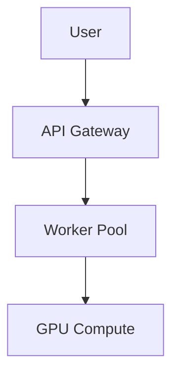

# 📚 CIRO Network Documentation

Welcome to the CIRO Network documentation system! This directory contains all
the documentation for the CIRO Network project, built with
[mdBook](https://rust-lang.github.io/mdBook/) for an elegant, searchable, and
maintainable documentation experience.

## 🏗️ Documentation Architecture

Our documentation is designed with **clarity, completeness, and consistency** in
mind:

```
docs/
├── book.toml              # mdBook configuration
├── README.md              # This file
├── src/                   # Documentation source files
│   ├── SUMMARY.md         # Navigation structure
│   ├── introduction.md    # Main landing page
│   ├── getting-started/   # Quick start guides
│   ├── user-guides/       # User-focused documentation
│   ├── architecture/      # Technical architecture
│   ├── development/       # Developer documentation
│   ├── api-reference/     # API documentation
│   ├── deployment/        # Production deployment
│   ├── contributing/      # Contribution guidelines
│   ├── resources/         # Tutorials and research
│   └── appendices/        # Reference materials
├── theme/                 # Custom styling
│   ├── ciro-theme.css     # Custom CSS theme
│   └── custom.css         # Additional customizations
└── images/                # Documentation images
```

## 🚀 Quick Start

### Development Mode

Start the documentation development server with hot reload:

```bash
# Using npm scripts (recommended)
npm run dev:docs

# Or directly with mdBook
cd docs && mdbook serve --open
```

The documentation will be available at `http://localhost:3000` with automatic
rebuilding when you make changes.

### Building

Build the documentation for production:

```bash
# Using npm scripts
npm run build:docs

# Or directly with mdBook
cd docs && mdbook build
```

The built documentation will be in `docs/book/` directory.

### Testing

Test code examples and check for issues:

```bash
# Test all code examples
npm run test:docs

# Check for broken links and lint markdown
npm run check:docs
```

## 🎨 Features

### Professional Styling

- **Custom CIRO theme** with brand colors and elegant typography
- **Dark mode optimized** for comfortable reading
- **Responsive design** that works on all devices
- **Interactive elements** with hover effects and animations

### Rich Content Support

- **Mermaid diagrams** for system architecture and flowcharts
- **Code syntax highlighting** for Rust, Cairo, TypeScript, and more
- **Admonitions** for notes, tips, warnings, and important information
- **Search functionality** with full-text search
- **Print support** for offline reading

### Developer Experience

- **Hot reload** during development
- **Automatic link checking** to prevent broken links
- **Code example testing** to ensure examples always work
- **Markdown linting** for consistent formatting
- **CI/CD integration** for automated building and deployment

## 📝 Writing Documentation

### Getting Started

1. Navigate to the appropriate section in `docs/src/`
2. Create or edit markdown files following our
   [Documentation Standards](src/contributing/standards/documentation.md)
3. Use the development server to preview your changes
4. Follow the established patterns and templates

### Content Guidelines

#### Page Structure

Every documentation page should follow this template:

```markdown
# Page Title

Brief introduction explaining what this page covers and who it's for.

## 🎯 Prerequisites

- Required knowledge
- Required tools
- Links to setup instructions

## 📋 Overview

High-level explanation of concepts.

## 🚀 Implementation

Step-by-step instructions with examples.

## 💡 Examples

Working code examples with explanations.

## ⚠️ Troubleshooting

Common issues and solutions.

## 🔗 Related Resources

Links to related documentation and external resources.
```

#### Writing Style

- **Clear and concise**: Get to the point quickly
- **Active voice**: "Configure the worker" vs "The worker should be configured"
- **Second person**: Address the reader directly with "you"
- **Inclusive language**: Welcome developers of all skill levels

#### Code Examples

All code examples must be:

- **Complete and runnable**: Include all necessary imports and setup
- **Tested**: Verify examples work with current codebase
- **Well-commented**: Explain non-obvious parts
- **Up-to-date**: Keep synchronized with code changes

### Visual Elements

#### Diagrams

Use Mermaid for system diagrams:



#### Admonitions

Use admonitions for special content:

```markdown
<div class="admonition note">
<p class="admonition-title">📝 Note</p>
<p>Additional helpful information.</p>
</div>

<div class="admonition tip">
<p class="admonition-title">💡 Tip</p>
<p>Best practices and helpful advice.</p>
</div>

<div class="admonition warning">
<p class="admonition-title">⚠️ Warning</p>
<p>Important information about potential issues.</p>
</div>
```

## 🔧 Configuration

### mdBook Configuration

The documentation is configured via `book.toml`:

- **Title and metadata**: Project information and branding
- **Theme customization**: Custom CSS and JavaScript
- **Preprocessors**: Mermaid, search, link checking
- **Output formats**: HTML, PDF, EPUB support
- **GitHub integration**: Edit links and repository information

### Custom Styling

Our custom theme is defined in `theme/ciro-theme.css`:

- **Brand colors**: CIRO Network color palette
- **Typography**: Professional font stack with Inter and JetBrains Mono
- **Component styling**: Cards, buttons, navigation elements
- **Responsive design**: Mobile-first approach
- **Dark mode optimization**: Elegant dark theme

### CI/CD Integration

Documentation is automatically:

- **Built and tested** on every pull request
- **Deployed to GitHub Pages** on main branch updates
- **Link checked** to prevent broken internal/external links
- **Linted** for consistent markdown formatting

## 🧪 Testing and Quality

### Automated Testing

Our documentation includes comprehensive testing:

```bash
# Test all code examples
mdbook test

# Lint markdown files
markdownlint docs/src/**/*.md

# Check for broken links
lychee docs/src/**/*.md

# Build and verify output
mdbook build
```

### Quality Checklist

Before publishing documentation:

- [ ] All code examples are tested and working
- [ ] Links are valid and functional
- [ ] Formatting follows style guide
- [ ] Content is accurate and up-to-date
- [ ] Images have descriptive alt text
- [ ] Mobile layout is tested

## 🤝 Contributing

### Contribution Workflow

1. **Read the standards**: Review our
   [Documentation Standards](src/contributing/standards/documentation.md)
2. **Create a branch**: Use descriptive branch names like
   `docs/improve-api-reference`
3. **Make changes**: Follow established patterns and templates
4. **Test locally**: Use the development server to preview changes
5. **Submit PR**: Include clear description of changes and screenshots if
   applicable

### Getting Help

- **Documentation Standards**: See
  [Documentation Standards](src/contributing/standards/documentation.md)
- **Style Guide**: Follow the established patterns in existing docs
- **Templates**: Use the templates provided in the standards guide
- **Issues**: Report documentation issues on
  [GitHub Issues](https://github.com/ciro-ai-labs/ciro-network/issues)

## 📊 Documentation Metrics

### Analytics

We track documentation usage to improve content:

- **Page views**: Most and least visited pages
- **Search queries**: What users are looking for
- **Bounce rate**: Content effectiveness
- **User feedback**: Collect suggestions and improvements

### Maintenance

Regular documentation maintenance includes:

- **Quarterly reviews**: Check for outdated information
- **Release updates**: Update docs with each software release
- **Link checking**: Verify all links remain valid
- **User feedback**: Incorporate suggestions and corrections

## 🚀 Deployment

### GitHub Pages

Documentation is automatically deployed to GitHub Pages:

- **URL**: `https://ciro-ai-labs.github.io/ciro-network/`
- **Custom domain**: `docs.ciro.network` (when configured)
- **SSL**: Automatically provided by GitHub Pages
- **CDN**: Global content delivery network

### Local Deployment

For testing deployment locally:

```bash
# Build documentation
npm run build:docs

# Serve built documentation
cd docs/book && python -m http.server 8000
```

## 📈 Future Enhancements

### Planned Features

- **Multi-language support**: Internationalization for global audience
- **Interactive tutorials**: Hands-on learning experiences
- **API playground**: Interactive API testing within documentation
- **Version management**: Support for multiple documentation versions
- **Advanced search**: Semantic search and filtering capabilities

### Community Contributions

We welcome contributions to improve the documentation:

- **Content updates**: Keep information current and accurate
- **New guides**: Add tutorials and how-to guides
- **Improvements**: Enhance existing content and structure
- **Translations**: Help make documentation accessible globally

---

## 🔗 Quick Links

- **[Documentation Standards](src/contributing/standards/documentation.md)**:
  Complete style and content guidelines
- **[mdBook Guide](https://rust-lang.github.io/mdBook/)**: Official mdBook
  documentation
- **[Mermaid Docs](https://mermaid-js.github.io/mermaid/)**: Diagram syntax
  reference
- **[GitHub Issues](https://github.com/ciro-ai-labs/ciro-network/issues)**:
  Report documentation issues
- **[Contributing Guide](src/contributing/guide.md)**: How to contribute to the
  project

---

_Built with ❤️ for the CIRO Network community. Together, we're building the
future of decentralized compute._
