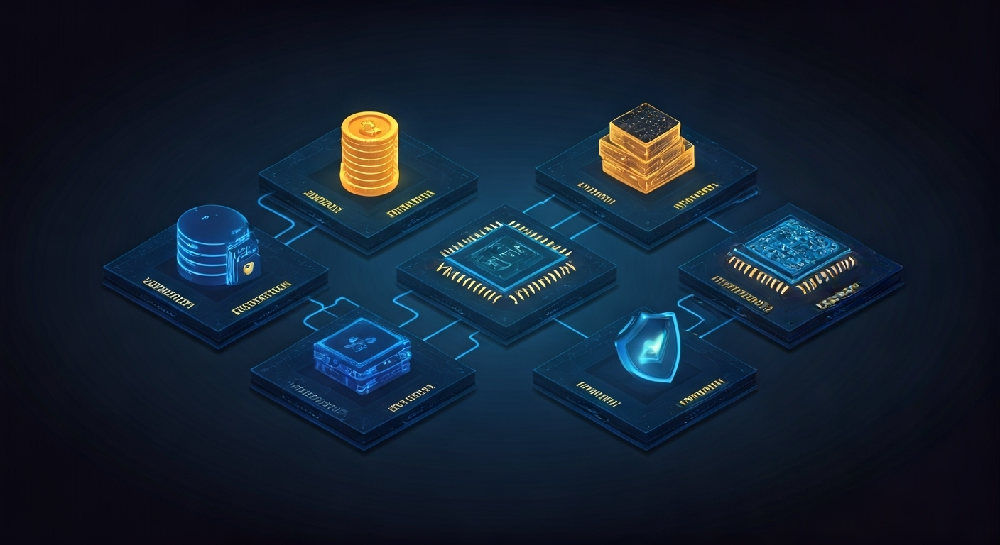

# 👋 Welcome to the Ciro Network Community!

**We’re so glad you found us.** Whether you’re a developer, GPU provider, researcher, builder, or just curious about the future of decentralized AI, you belong here. Ciro is a place for everyone who believes in open, verifiable, and accessible compute—no matter your background or experience.

Our community is global, inclusive, and always ready to help. We’re united by a shared vision: to make powerful, trustworthy AI and compute available to all, not just the privileged few. If you want to build, contribute, learn, or simply explore, you’re in the right place.

- **New to Web3 or AI?** No problem—our guides and community are here for you.
- **Seasoned developer or GPU pro?** Dive in and help shape the future.
- **Curious about decentralized infrastructure?** You’re in the right place.

Let’s build the future of verifiable compute—together.

---

# Welcome to Ciro

**TL;DR**: Ciro Network is a decentralized compute layer for real-time AI and ZK workloads, built on Starknet and proven in industrial production environments. Think AWS compute meets DeFi economics, but with mathematical proofs and global reach.

---

## 🧬 **What We're Building**

**In one sentence**: A verifiable compute protocol that transforms underutilized GPUs into a global, trustless supercomputer for AI workloads.

**In one paragraph**: Ciro Network orchestrates distributed GPU resources through cryptographic proofs, enabling enterprises to access verifiable compute that traditional cloud providers simply cannot offer. Built on Starknet with ZK-ML verification, every inference, training job, and proof generation is both economically efficient and cryptographically sound.

**In one page**: The future of AI compute is not centralized data centers—it's an intelligent mesh of distributed resources, coordinated by economic incentives and secured by zero-knowledge proofs. Ciro Network is that future, operational today. Born from real industrial necessity and battle-tested in production environments, Ciro is designed for engineers, researchers, and organizations who demand verifiable, censorship-resistant, and cost-efficient compute for real-world AI and ZK workloads.

---

## 🔥 **Born From Necessity**

Ciro wasn't born in a hackathon—it was born on the factory floor.

When our computer vision systems for Latin American industrial plants hit **$60,000/month AWS surges**, we faced a choice: accept the economic brutality of centralized compute, or build something smarter. Our industrial vision systems were processing thousands of defect detection jobs daily, but centralized clouds were draining resources faster than we could scale.

We chose to build.

First for ourselves. Then for the world.

The result? A protocol achieving **15,000 transactions per second** on Starknet testnet, with **sub-200ms latency** and production-ready architecture. Currently in final testing phase before mainnet deployment to real factories, production lines, and enterprise environments.

---

## ⚡ **Why This Matters**

### **🔬 Scientific Sovereignty**
AI shouldn't require permission from hyperscale clouds. Researchers, startups, and enterprises deserve compute sovereignty—the ability to run AI workloads without vendor lock-in, geographic restrictions, or opaque pricing. When compute infrastructure becomes a bottleneck to innovation, progress stagnates.

### **🌍 Economic Liberation** 
The current compute oligopoly wastes resources while inflating costs. Centralized providers charge premium rates while millions of GPUs sit idle globally. Ciro creates a more efficient market that redistributes value to GPU owners worldwide, enabling competitive pricing through genuine market dynamics rather than corporate markup.

### **🛡️ Verifiable Truth**
In an era of AI hallucinations and deepfakes, Ciro provides mathematical proof that your AI computations are correct. Every inference carries a ZK-proof of validity—no trust required. When your model says a medical scan is clear or a financial transaction is valid, you need more than "trust us."

### **🚀 Unstoppable Innovation**
Decentralized compute accelerates AI development by removing barriers to experimentation. When compute is abundant and affordable, innovation flourishes. When it's scarce and expensive, only the biggest players can participate.

---

## 📊 **The Reality Check**

| Provider | Cost per H100-hour | Availability | Verification | Sovereignty |
|----------|-------------------|-------------|--------------|-------------|
| **AWS/Azure** | $4.10-6.98 | Geographic limits | Trust-based | Corporate controlled |
| **Render** | ~$2.50 (OBH) | 3D rendering focus | Watermarking | Partial governance |
| **Akash** | ~$1.15 | General compute | Reputation | Cosmos governance |
| **io.net/Spheron** | $1.87-2.40 | ML optimization | Proof-of-work | Token governance |
| **Ciro Network** | $1.40-2.20 | Global mesh | **ZK-proven** | Community owned |

*Ciro's strategic advantage: While competitors compete on price or specialization, Ciro enables **provably correct computation**—unlocking new markets like DeFi AI and on-chain gaming that require cryptographic guarantees.*

### **Performance Metrics That Matter**
- **15,000 transactions per second** achieved in optimized testnet conditions (Mainnet: ~127 TPS sustained)
- **Sub-200ms latency** demonstrated in distributed test environments
- **Production-ready architecture** validated through comprehensive testing
- **Competitive pricing** targeting $1.40-2.20/H100-hour vs. AWS $4.10+ and Azure $6.98+

---

## 🤝 **Who is Ciro For?**

### **🏗️ Starknet dApp Developers**
Who need affordable AI inference integrated directly into their smart contracts. Our JobManager contract handles job submission, escrow, and payment settlement on-chain, while the Paymaster enables gas-free transactions for end users. Perfect for DeFi protocols adding ML-based risk analysis, gaming dApps with AI NPCs, or any application requiring real-time intelligence.

### **🔬 AI/ML Engineers & Researchers**
Who need verifiable compute for diverse AI workloads without vendor lock-in. Our smart contracts support **13 specialized job types**: AI Inference, AI Training, Computer Vision, NLP, Audio Processing, Time Series Analysis, Multimodal AI, Reinforcement Learning, Specialized AI, Proof Generation, Proof Verification, Data Processing, and Custom models. Submit jobs with framework-specific dependencies (TensorFlow, PyTorch, ONNX, etc.) and hardware requirements via Cairo contracts with cryptographic execution guarantees.

### **⚡ GPU Providers (Individual & Enterprise)**
Who want to monetize idle hardware through our CDC Pool staking system. Register workers with **8 hardware capability flags**: CUDA, OpenCL, FP16, INT8, NVLink, InfiniBand, Tensor Cores, and Multi-GPU support. Our tiered system supports everyone from basic GPU owners ($100 minimum stake) to institutional data centers ($500K+ stakes). Capability-based job matching ensures optimal resource utilization, while smart contract-based slashing and reputation scoring protect network integrity.

### **🏭 ZK Infrastructure Providers**
Who need high-performance proof generation for Starknet and other rollups. Our ProofVerifier contract specializes in recursive proofs, batch processing, and cross-chain bridge verification. Priority-based job allocation ensures critical blockchain infrastructure stays operational, with USD-denominated rewards for time-sensitive proof generation.

### **🌐 Web3 Infrastructure Teams**
Who want to build on protocol-native, verifiable compute. Deploy applications that inherit the sovereignty and cryptographic guarantees of their compute layer. Our smart contracts provide escrow, dispute resolution, and automated payment distribution—eliminating the need to trust centralized compute providers.

### **🎮 Game Developers & Creative Studios**
Who need compute for AI-powered NPCs, procedural generation, and real-time rendering workloads. Our **Custom** and **MultimodalAI** job types support Unity/Unreal Engine integration, dynamic NPC behavior, intelligent game balancing, and adaptive content generation. Framework dependencies support popular game AI libraries with hardware matching for Multi-GPU and Tensor Core requirements. Gas-free transactions via Paymaster ensure seamless player experiences.

### **🎨 Digital Artists & Content Creators**
Who require GPU compute for **artistic generation**, **video rendering**, and **audio composition**. Our smart contracts comprehensively support:
- **Custom Job Types** for specialized artistic AI models (Stable Diffusion, DALL-E derivatives, MidJourney-style workflows)
- **MultimodalAI** capabilities for text-to-image, image-to-video, and cross-modal artistic generation
- **AudioProcessing** jobs for AI music composition, voice synthesis, and audio enhancement
- **Video Rendering** through custom model requirements supporting high-memory GPU configurations
- **Framework Dependencies** for popular creative AI frameworks (ComfyUI, Automatic1111, RunPod workflows, FFmpeg processing)
- **Hardware Capability Matching** with Tensor Cores, Multi-GPU setups, and specialized GPU memory requirements for 4K/8K content creation

### **🏢 Enterprise Operations**
Who require auditable, cost-predictable compute for regulated workloads. Manufacturing quality control, financial risk analysis, medical imaging—domains where computational integrity is mandatory. Our Cairo contracts provide complete audit trails of job execution, payments, and verification proofs for compliance requirements.

---

## 🎯 **Technical Elegance**

Ciro achieves this through three core innovations:

### **🧠 ZK-ML Verification**
Every AI computation generates a STARK proof of correctness, verified on Starknet in ~2 seconds. Not just attestations or hash commitments—mathematical proof that your inference was computed correctly on the specified model with the given inputs.

### **⚡ Hybrid Orchestration** 
Smart routing between on-premises, edge, and network resources based on latency, cost, and security requirements. Your workload automatically finds the optimal compute environment without manual configuration.

### **💎 Economic Design**
Token-curated registry of compute providers with slashing conditions for malicious behavior and rewards for performance. Economics aligned for reliability, not just lowest price.

---

## 🛠️ **Built for Reality**

Unlike theoretical compute protocols, Ciro emerged from real-world usage:

### **🏭 Industrial Vision**
Object detection on assembly lines processing **thousands of items per hour**. When a false negative costs $10K in defective products, verification isn't academic—it's economic survival.

### **🏥 Medical AI**
HIPAA-compliant diagnostic imaging where patient safety demands both privacy and accuracy. Decentralized compute with cryptographic guarantees meets regulatory requirements that centralized clouds struggle with.

### **💰 Financial Models**
Risk analysis for emerging markets where data sovereignty and computational auditability aren't optional features—they're legal requirements.

### **🔬 Research Computing**
Training smaller models on federated data where compute costs can't exceed research grants, but results need to be reproducible and verifiable.

Each use case taught us what actually matters: **reliability**, **verifiability**, and **economic sustainability**. Not just theoretical scalability or benchmark performance.

---

## 🌐 **The Network Effect**

Ciro's power grows with its network:

### **Provider Diversity**
From gaming rigs in bedrooms to enterprise data centers, every GPU can contribute. Geographic and economic diversity creates resilience that no single cloud provider can match.

### **Workload Intelligence**
The network learns optimal placement for different workload types. Computer vision jobs route to providers with appropriate memory bandwidth. Training jobs find the lowest-latency multi-GPU clusters.

### **Economic Efficiency**
Market forces drive prices down while reliability requirements drive quality up. Providers compete on performance metrics, not marketing budgets.

---

## 🚀 **Technical Architecture Deep Dive**

For those who want to understand how the magic happens:

### **Smart Contract Layer (Cairo on Starknet)**
- **JobManager**: Job submission, worker assignment, and payment escrow for AI/ML and ZK proof workloads
- **CDC_Pool**: Worker registration, CIRO token staking (8 tiers: $100-$500K), and reputation-based job allocation
- **CIRO_Token**: ERC20 with governance, progressive burn mechanisms (30%→80% fee burns), and security budget protection
- **Paymaster**: Gas-free transactions for IoT devices and seamless dApp integration

### **Orchestration Layer (Rust)**
- Kafka-based job queuing supporting 13 AI job types (Computer Vision, NLP, Audio Processing, Time Series Analysis, Multimodal AI, Reinforcement Learning, etc.)
- Advanced worker capability matching: 8 hardware flags (CUDA, OpenCL, FP16, INT8, NVLink, InfiniBand, Tensor Cores, Multi-GPU)
- Framework dependency resolution (TensorFlow, PyTorch, ONNX, custom frameworks)
- P2P networking with libp2p for decentralized worker discovery and heartbeat systems

### **Verification Layer (ZK-STARK)**
- ProofVerifier contract supporting 5 proof types: Starknet Batch, Recursive Proof, zkML Inference, Cross-Chain Bridge, Application-Specific
- Integration with Giza/Orion for zkML inference verification with 4 priority levels (Standard, High, Critical, Emergency)
- Multi-party consensus validation and statistical sampling for different verification methods
- On-chain slashing for invalid proof submissions with cryptographic evidence handling

### **Provider Layer (Docker + GPU)**
- Rust-based worker nodes with CUDA/OpenCL capability detection
- Secure model deployment with hash-based verification
- Performance metrics tracking (completion rate, response time, quality scores)
- Tiered staking system aligning incentives with hardware investment

---

## 🌟 **What's Next?**

Ready to experience verifiable compute? Choose your path:

→ **[🚀 Getting Started](getting-started/README.md)** – Run your first job in 3 minutes  
→ **[🔧 Tech Architecture](tech/README.md)** – Deep dive into ZK-ML and orchestration  
→ **[💰 Tokenomics](tokenomics/README.md)** – Understand the economic design  
→ **[🤝 Contribute](contributing/README.md)** – Join the network as a provider or developer

---

*Ciro Network: Where mathematics meets market forces to democratize AI compute.*

**The future isn't centralized. It's verified.**
