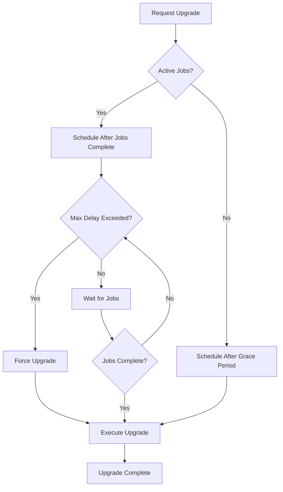

# Governance and Upgradability Framework

## Overview

The CIRO Network governance and upgradability framework provides a comprehensive, secure, and job-aware system for managing protocol upgrades and community governance. This framework is specifically designed for DePIN (Decentralized Physical Infrastructure Network) applications where active computational jobs must be considered during upgrades.

## Architecture

### Core Components

#### 1. Governance System

- **Tiered Proposal System**: Different proposal types with varying requirements
- **Voting Power Calculation**: Multi-factor voting power based on tokens, stakes, reputation, and resource contributions
- **Delegation**: Vote delegation with automatic power tracking
- **Timelock**: Configurable delays for different proposal types
- **Emergency Controls**: Multi-signature emergency actions

#### 2. Upgradability Patterns

- **UUPS (Universal Upgradeable Proxy Standard)**: Gas-efficient upgrades with implementation control
- **Transparent Proxy**: Admin-controlled upgrades with function selector isolation
- **Diamond Proxy**: Multi-facet proxy for modular upgrades
- **Job-Aware Upgrades**: Upgrade scheduling that considers active computational jobs

#### 3. Security Features

- **Multi-layer Authorization**: Role-based access control with emergency overrides
- **Upgrade Validation**: Comprehensive pre-upgrade checks and compatibility validation
- **State Migration**: Automated storage layout migration for complex upgrades
- **Rollback Mechanisms**: Emergency rollback capabilities for failed upgrades

## Governance Model

### Proposal Types

#### Emergency Proposals

- **Voting Period**: 1 hour
- **Timelock**: None (immediate execution)
- **Quorum**: 10% of total voting power
- **Authorization**: Emergency council or multi-signature wallet only
- **Use Cases**: Critical security fixes, exploit mitigation

#### Critical Proposals

- **Voting Period**: 24 hours
- **Timelock**: 24 hours
- **Quorum**: 20% of total voting power
- **Authorization**: Standard proposal threshold
- **Use Cases**: Important protocol changes, security updates

#### Standard Proposals

- **Voting Period**: 7 days
- **Timelock**: 7 days
- **Quorum**: 25% of total voting power
- **Authorization**: Standard proposal threshold
- **Use Cases**: General protocol improvements, feature additions

#### Parameter Proposals

- **Voting Period**: 3 days
- **Timelock**: 3 days
- **Quorum**: 16.7% of total voting power
- **Authorization**: Standard proposal threshold
- **Use Cases**: Configuration changes, fee adjustments

#### Upgrade Proposals

- **Voting Period**: 7 days
- **Timelock**: 14 days
- **Quorum**: 33.3% of total voting power
- **Authorization**: Enhanced proposal threshold
- **Use Cases**: Smart contract upgrades, major protocol changes

### Voting Power Calculation

The voting power system uses a multi-factor approach to ensure fair representation:

```cairo
voting_power = base_power + stake_bonus + reputation_bonus + lock_bonus + resource_bonus
```

#### Components

1. **Base Power**: `sqrt(token_balance)` (quadratic voting)
2. **Stake Bonus**: `(stake_amount * 50) / 100` (50% bonus for staking)
3. **Reputation Bonus**: `(reputation_score * base_power) / REPUTATION_SCALE`
4. **Lock Bonus**: Time-weighted bonus for longer token locks
   - 1 year lock: 50% bonus
   - 6 months lock: 25% bonus
   - Less than 6 months: No bonus
5. **Resource Bonus**: Bonus based on contributed computational resources

### Delegation System

- **Flexible Delegation**: Users can delegate voting power to any address
- **Automatic Tracking**: Delegated power is automatically tracked and updated
- **Revocable**: Delegations can be changed or revoked at any time
- **Event Logging**: All delegation changes are logged for transparency

## Upgradability Patterns

### UUPS (Universal Upgradeable Proxy Standard)

**Advantages:**

- Gas efficient (no storage reads in proxy)
- Implementation controls upgrades
- Smaller proxy contract size

**Implementation:**

```cairo
#[starknet::contract]
mod UUPSProxy {
    use ciro_contracts::utils::upgradability::UUPSProxyComponent;
    
    component!(path: UUPSProxyComponent, storage: uups, event: UUPSEvent);
    
    #[abi(embed_v0)]
    impl UUPSProxyImpl = UUPSProxyComponent::UUPSProxyImpl<ContractState>;
    
    impl UUPSInternalImpl = UUPSProxyComponent::InternalImpl<ContractState>;
}
```

### Transparent Proxy

**Advantages:**

- Clear separation between admin and user functions
- Prevents function selector clashes
- Well-established pattern

**Implementation:**

```cairo
#[starknet::contract]
mod TransparentProxy {
    use ciro_contracts::utils::upgradability::TransparentProxyComponent;
    
    component!(path: TransparentProxyComponent, storage: transparent, event: TransparentEvent);
    
    #[abi(embed_v0)]
    impl TransparentProxyImpl = TransparentProxyComponent::TransparentProxyImpl<ContractState>;
    
    impl TransparentInternalImpl = TransparentProxyComponent::InternalImpl<ContractState>;
}
```

### Diamond Proxy (Multi-Facet)

**Advantages:**

- Modular upgrades (upgrade individual functions)
- Overcome contract size limits
- Flexible architecture

**Implementation:**

```cairo
#[starknet::contract]
mod DiamondProxy {
    use ciro_contracts::utils::upgradability::DiamondProxyComponent;
    
    component!(path: DiamondProxyComponent, storage: diamond, event: DiamondEvent);
    
    #[abi(embed_v0)]
    impl DiamondProxyImpl = DiamondProxyComponent::DiamondProxyImpl<ContractState>;
    
    impl DiamondInternalImpl = DiamondProxyComponent::InternalImpl<ContractState>;
}
```

### Job-Aware Upgrades

The job-aware upgrade system ensures that computational jobs are not interrupted during upgrades:

#### Key Features

1. **Active Job Tracking**: Monitors running computational jobs
2. **Graceful Scheduling**: Schedules upgrades when no jobs are active
3. **Maximum Delay**: Enforces upgrade execution after maximum delay
4. **Maintenance Mode**: Prevents new jobs during upgrade preparation
5. **Emergency Override**: Allows forced upgrades in critical situations

#### Upgrade Flow



## Security Considerations

### Multi-Layer Security

1. **Authorization Layer**
   - Role-based access control
   - Multi-signature requirements
   - Emergency council powers

2. **Validation Layer**
   - Proposal parameter validation
   - Upgrade compatibility checks
   - State migration validation

3. **Execution Layer**
   - Timelock enforcement
   - Atomic upgrade execution
   - Rollback capabilities

4. **Monitoring Layer**
   - Event logging
   - State change tracking
   - Anomaly detection

### Emergency Procedures

#### Emergency Pause

- Immediate halt of all non-critical functions
- Triggered by emergency council or critical vulnerabilities
- Requires governance vote to resume

#### Emergency Upgrade

- Bypass normal timelock for critical security fixes
- Requires multi-signature approval
- Limited to security-related changes

#### Rollback Mechanisms

- Automatic rollback on upgrade failure
- Manual rollback for discovered issues
- State restoration from pre-upgrade snapshots

## Implementation Guide

### Setting Up Governance

1. **Deploy Governance Contract**

```cairo
#[starknet::contract]
mod CIROGovernance {
    use ciro_contracts::utils::governance::GovernanceComponent;
    
    component!(path: GovernanceComponent, storage: governance, event: GovernanceEvent);
    
    #[abi(embed_v0)]
    impl GovernanceImpl = GovernanceComponent::GovernanceImpl<ContractState>;
    
    impl GovernanceInternalImpl = GovernanceComponent::InternalImpl<ContractState>;
    
    #[constructor]
    fn constructor(
        ref self: ContractState,
        governance_token: ContractAddress,
        emergency_multisig: ContractAddress,
        initial_config: GovernanceConfig
    ) {
        self.governance.initializer(initial_config);
    }
}
```

2. **Configure Initial Parameters**

```cairo
let config = GovernanceConfig {
    voting_period: 604800, // 7 days
    timelock_delay: 604800, // 7 days
    proposal_threshold: 1000000, // 1M tokens
    quorum_threshold: 5000000, // 5M tokens
    emergency_multisig: emergency_multisig_address,
    governance_token: token_address,
    max_operations_per_proposal: 10,
};
```

### Setting Up Upgradability

1. **Choose Upgrade Pattern**
   - UUPS for gas efficiency
   - Transparent for simplicity
   - Diamond for modularity

2. **Deploy Proxy Contract**

```cairo
let proxy = deploy_contract(
    "UUPSProxy",
    array![implementation_hash, admin_address]
);
```

3. **Configure Job-Aware Upgrades**

```cairo
let job_aware_upgrade = deploy_contract(
    "JobAwareUpgrade",
    array![
        admin_address,
        job_registry_address,
        3600, // 1 hour grace period
        604800 // 7 days max delay
    ]
);
```

## Best Practices

### Governance

1. **Gradual Decentralization**: Start with smaller quorums and gradually increase
2. **Clear Documentation**: Document all proposals thoroughly
3. **Community Engagement**: Encourage active participation in governance
4. **Security Reviews**: Require security audits for significant changes

### Upgrades

1. **Comprehensive Testing**: Test all upgrades on testnets first
2. **Backward Compatibility**: Maintain compatibility when possible
3. **Migration Planning**: Plan storage migrations carefully
4. **Rollback Preparation**: Always have rollback plans ready

### Security

1. **Multi-Signature**: Use multi-sig for critical operations
2. **Time Delays**: Implement appropriate time delays for changes
3. **Emergency Procedures**: Have clear emergency response procedures
4. **Regular Audits**: Conduct regular security audits

## Integration with CIRO Network

### Job Manager Integration

- Upgrade scheduling considers active AI computation jobs
- Automatic job completion tracking
- Graceful handling of long-running training jobs

### Worker Pool Integration

- Worker consensus on upgrade proposals
- Stake-weighted voting for infrastructure changes
- Resource contribution bonuses in voting power

### Economic Model Integration

- Token-based governance with staking bonuses
- Fee parameter adjustments through governance
- Economic incentive alignment with protocol health

## Monitoring and Analytics

### Key Metrics

- Proposal success rates
- Voter participation rates
- Upgrade execution times
- Emergency action frequency

### Dashboards

- Real-time governance activity
- Upgrade status tracking
- Security event monitoring
- Community engagement metrics

## Future Enhancements

### Planned Features

1. **Liquid Democracy**: Delegate to different addresses for different topics
2. **Conviction Voting**: Time-weighted voting for more nuanced decisions
3. **Quadratic Funding**: Community-driven funding for protocol improvements
4. **Cross-Chain Governance**: Governance across multiple chains

### Research Areas

1. **MEV Protection**: Protecting governance from MEV attacks
2. **Privacy**: Private voting mechanisms
3. **Scalability**: Scaling governance to millions of participants
4. **AI Integration**: AI-assisted governance decision making

## Conclusion

The CIRO Network governance and upgradability framework provides a robust, secure, and flexible foundation for decentralized protocol management. By combining proven governance patterns with innovative job-aware upgrade mechanisms, the system ensures that the network can evolve while maintaining operational continuity for critical computational workloads.

The framework's modular design allows for gradual adoption and customization based on specific network requirements, while the comprehensive security measures protect against common governance attacks and upgrade failures.
