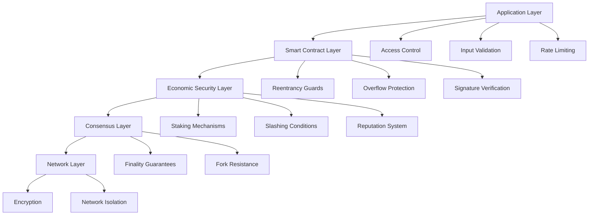
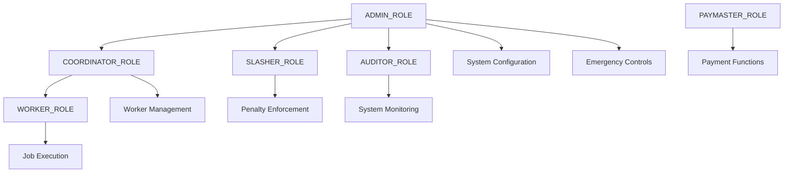
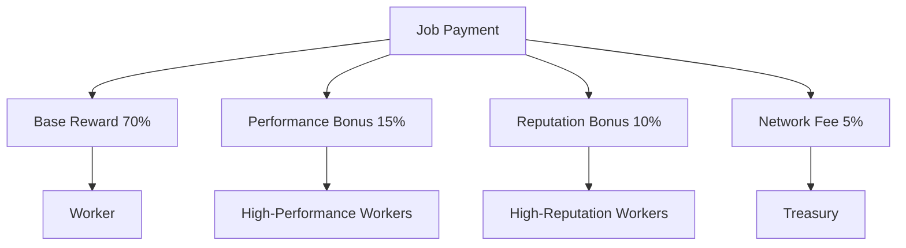

# CIRO Network Security and Access Control Model

## Overview

The CIRO Network implements a comprehensive multi-layered security model designed specifically for DePIN (Decentralized Physical Infrastructure Networks) applications. This document outlines the security architecture, access control mechanisms, threat mitigation strategies, and implementation details for the smart contract ecosystem.

## Table of Contents

1. [Security Architecture](#security-architecture)
2. [Threat Model](#threat-model)
3. [Access Control Framework](#access-control-framework)
4. [Economic Security](#economic-security)
5. [Smart Contract Security](#smart-contract-security)
6. [Governance and Emergency Controls](#governance-and-emergency-controls)
7. [Implementation Guidelines](#implementation-guidelines)
8. [Audit and Compliance](#audit-and-compliance)

## Security Architecture

### Multi-Layer Defense Strategy

The CIRO Network employs a defense-in-depth approach with multiple security layers:



### Core Security Principles

1. **Principle of Least Privilege**: Each component has minimal necessary permissions
2. **Defense in Depth**: Multiple layers of security controls
3. **Fail-Safe Defaults**: Secure default configurations
4. **Complete Mediation**: All access attempts are validated
5. **Economy of Mechanism**: Simple, auditable security mechanisms
6. **Separation of Duties**: Critical operations require multiple approvals

## Threat Model

### DePIN-Specific Threats

#### 1. Worker Collusion Attacks

- **Description**: Multiple worker nodes coordinate to manipulate job results
- **Impact**: Compromised computation integrity, economic loss
- **Mitigation**:
  - Cryptographic result verification
  - Reputation-based worker selection
  - Economic penalties through slashing

#### 2. Sybil Attacks

- **Description**: Attacker creates multiple fake worker identities
- **Impact**: Network control, unfair reward distribution
- **Mitigation**:
  - Stake-based participation requirements
  - Progressive staking requirements
  - Behavioral analysis and detection

#### 3. Economic Extraction Attacks

- **Description**: Exploitation of smart contract vulnerabilities to drain funds
- **Impact**: Financial loss, system instability
- **Mitigation**:
  - Comprehensive smart contract audits
  - Formal verification of critical functions
  - Circuit breakers and emergency controls

#### 4. Data Poisoning Attacks

- **Description**: Submission of malicious inputs to compromise workers
- **Impact**: Worker node compromise, network degradation
- **Mitigation**:
  - Input validation and sanitization
  - Sandboxed execution environments
  - Anomaly detection systems

### Attack Surface Analysis

#### Smart Contract Layer

- **Entry Points**: Public functions, external calls
- **Assets**: Escrowed funds, staked tokens, reputation scores
- **Vulnerabilities**: Logic bugs, reentrancy, overflow/underflow

#### Worker Infrastructure

- **Entry Points**: Job submission, result reporting
- **Assets**: Computational resources, private keys
- **Vulnerabilities**: Remote code execution, data exfiltration

#### Governance System

- **Entry Points**: Proposal submission, voting mechanisms
- **Assets**: System parameters, upgrade capabilities
- **Vulnerabilities**: Vote manipulation, governance attacks

## Access Control Framework

### Role-Based Access Control (RBAC)

The system implements a hierarchical RBAC model with the following roles:

#### Core Roles

```cairo
// Core system roles
pub const ADMIN_ROLE: felt252 = 'ADMIN_ROLE';
pub const WORKER_ROLE: felt252 = 'WORKER_ROLE';
pub const COORDINATOR_ROLE: felt252 = 'COORDINATOR_ROLE';
pub const PAYMASTER_ROLE: felt252 = 'PAYMASTER_ROLE';
pub const SLASHER_ROLE: felt252 = 'SLASHER_ROLE';
pub const AUDITOR_ROLE: felt252 = 'AUDITOR_ROLE';
```

#### Role Hierarchy



#### Permission Matrix

| Role | Job Submission | Worker Management | Payment Release | System Config | Emergency Actions |
|------|---------------|-------------------|-----------------|---------------|-------------------|
| ADMIN | ✓ | ✓ | ✓ | ✓ | ✓ |
| COORDINATOR | ✓ | ✓ | ✗ | ✗ | ✗ |
| WORKER | ✓ | ✗ | ✗ | ✗ | ✗ |
| PAYMASTER | ✗ | ✗ | ✓ | ✗ | ✗ |
| SLASHER | ✗ | ✗ | ✗ | ✗ | ✗ |
| AUDITOR | ✗ | ✗ | ✗ | ✗ | ✗ |

### Access Control Implementation

#### Component-Based Access Control

```cairo
#[starknet::component]
pub mod AccessControlComponent {
    use starknet::ContractAddress;
    use starknet::get_caller_address;

    #[storage]
    struct Storage {
        roles: LegacyMap::(ContractAddress, felt252) => bool,
        role_admins: LegacyMap::felt252 => felt252,
        role_members: LegacyMap::felt252 => u32,
    }

    #[event]
    #[derive(Drop, starknet::Event)]
    pub enum Event {
        RoleGranted: RoleGranted,
        RoleRevoked: RoleRevoked,
        RoleAdminChanged: RoleAdminChanged,
    }

    #[derive(Drop, starknet::Event)]
    pub struct RoleGranted {
        pub role: felt252,
        pub account: ContractAddress,
        pub sender: ContractAddress,
    }

    #[derive(Drop, starknet::Event)]
    pub struct RoleRevoked {
        pub role: felt252,
        pub account: ContractAddress,
        pub sender: ContractAddress,
    }

    #[derive(Drop, starknet::Event)]
    pub struct RoleAdminChanged {
        pub role: felt252,
        pub previous_admin_role: felt252,
        pub new_admin_role: felt252,
    }

    #[generate_trait]
    pub impl InternalImpl<
        TContractState, +HasComponent<TContractState>
    > of InternalTrait<TContractState> {
        fn assert_only_role(self: @ComponentState<TContractState>, role: felt252) {
            let caller = get_caller_address();
            assert(self.has_role(caller, role), 'AccessControl: unauthorized');
        }

        fn has_role(
            self: @ComponentState<TContractState>, 
            account: ContractAddress, 
            role: felt252
        ) -> bool {
            self.roles.read((account, role))
        }

        fn grant_role(
            ref self: ComponentState<TContractState>, 
            account: ContractAddress, 
            role: felt252
        ) {
            let caller = get_caller_address();
            let admin_role = self.role_admins.read(role);
            assert(self.has_role(caller, admin_role), 'AccessControl: unauthorized');
            
            if !self.has_role(account, role) {
                self.roles.write((account, role), true);
                let count = self.role_members.read(role);
                self.role_members.write(role, count + 1);
                self.emit(RoleGranted { role, account, sender: caller });
            }
        }

        fn revoke_role(
            ref self: ComponentState<TContractState>, 
            account: ContractAddress, 
            role: felt252
        ) {
            let caller = get_caller_address();
            let admin_role = self.role_admins.read(role);
            assert(self.has_role(caller, admin_role), 'AccessControl: unauthorized');
            
            if self.has_role(account, role) {
                self.roles.write((account, role), false);
                let count = self.role_members.read(role);
                self.role_members.write(role, count - 1);
                self.emit(RoleRevoked { role, account, sender: caller });
            }
        }
    }
}
```

#### Multi-Signature Controls

Critical operations require multi-signature approval:

```cairo
#[starknet::component]
pub mod MultiSigComponent {
    use starknet::ContractAddress;
    use starknet::get_caller_address;

    #[storage]
    struct Storage {
        owners: LegacyMap::ContractAddress => bool,
        owner_count: u32,
        required_confirmations: u32,
        transaction_count: u32,
        transactions: LegacyMap::u32 => Transaction,
        confirmations: LegacyMap::(u32, ContractAddress) => bool,
        confirmation_count: LegacyMap::u32 => u32,
    }

    #[derive(Drop, Serde, starknet::Store)]
    pub struct Transaction {
        pub to: ContractAddress,
        pub selector: felt252,
        pub calldata: Array<felt252>,
        pub executed: bool,
        pub timestamp: u64,
    }

    #[generate_trait]
    pub impl InternalImpl<
        TContractState, +HasComponent<TContractState>
    > of InternalTrait<TContractState> {
        fn require_confirmation(
            ref self: ComponentState<TContractState>,
            target: ContractAddress,
            selector: felt252,
            calldata: Array<felt252>
        ) -> u32 {
            let caller = get_caller_address();
            assert(self.owners.read(caller), 'Not owner');
            
            let transaction_id = self.transaction_count.read();
            self.transaction_count.write(transaction_id + 1);
            
            let transaction = Transaction {
                to: target,
                selector,
                calldata,
                executed: false,
                timestamp: starknet::get_block_timestamp(),
            };
            
            self.transactions.write(transaction_id, transaction);
            self.confirmations.write((transaction_id, caller), true);
            self.confirmation_count.write(transaction_id, 1);
            
            transaction_id
        }

        fn execute_if_confirmed(
            ref self: ComponentState<TContractState>,
            transaction_id: u32
        ) -> bool {
            let confirmation_count = self.confirmation_count.read(transaction_id);
            let required = self.required_confirmations.read();
            
            if confirmation_count >= required {
                let transaction = self.transactions.read(transaction_id);
                if !transaction.executed {
                    // Execute transaction
                    let mut transaction = transaction;
                    transaction.executed = true;
                    self.transactions.write(transaction_id, transaction);
                    
                    // Make the actual call
                    starknet::call_contract_syscall(
                        transaction.to,
                        transaction.selector,
                        transaction.calldata.span()
                    ).unwrap();
                    
                    return true;
                }
            }
            false
        }
    }
}
```

## Economic Security

### Staking Mechanism

#### Stake Requirements

```cairo
// Minimum stake amounts based on worker capabilities
pub const MIN_STAKE_BASIC: u256 = 1000000000000000000000;      // 1,000 tokens
pub const MIN_STAKE_ADVANCED: u256 = 5000000000000000000000;   // 5,000 tokens
pub const MIN_STAKE_PREMIUM: u256 = 10000000000000000000000;   // 10,000 tokens

// Staking multipliers for different lock periods
pub const STAKE_MULTIPLIER_30_DAYS: u256 = 1100000000000000000; // 1.1x
pub const STAKE_MULTIPLIER_90_DAYS: u256 = 1250000000000000000; // 1.25x
pub const STAKE_MULTIPLIER_180_DAYS: u256 = 1500000000000000000; // 1.5x
```

#### Slashing Conditions

| Violation Type | Severity | Slash Percentage | Recovery Period |
|---------------|----------|------------------|-----------------|
| Late Submission | Minor | 1% | 24 hours |
| Incorrect Result | Major | 10% | 7 days |
| Malicious Behavior | Critical | 50% | 30 days |
| Repeated Violations | Critical | 100% | Permanent |

#### Reputation System

```cairo
#[derive(Copy, Drop, Serde, starknet::Store)]
pub struct ReputationScore {
    pub base_score: u16,           // 0-1000 base reputation
    pub success_rate: u16,         // Percentage of successful jobs
    pub response_time: u32,        // Average response time in seconds
    pub stake_duration: u64,       // Time staked in seconds
    pub total_jobs: u32,           // Total jobs completed
    pub disputes_lost: u16,        // Number of disputes lost
    pub last_updated: u64,         // Last update timestamp
}

impl ReputationScore {
    pub fn calculate_final_score(self: @ReputationScore) -> u16 {
        let base = *self.base_score;
        
        // Success rate bonus (up to 200 points)
        let success_bonus = (*self.success_rate * 200) / 100;
        
        // Stake duration bonus (up to 100 points)
        let stake_bonus = min((*self.stake_duration / (30 * 24 * 3600)) * 10, 100);
        
        // Dispute penalty (up to -300 points)
        let dispute_penalty = min(*self.disputes_lost * 30, 300);
        
        // Experience bonus (up to 50 points)
        let experience_bonus = min(*self.total_jobs / 100, 50);
        
        let final_score = base + success_bonus + stake_bonus + experience_bonus;
        
        if final_score > dispute_penalty {
            final_score - dispute_penalty
        } else {
            0
        }
    }
}
```

### Economic Incentives

#### Reward Distribution



#### Dynamic Pricing Model

```cairo
pub fn calculate_job_price(
    model_requirements: ModelRequirements,
    worker_reputation: u16,
    network_utilization: u16
) -> u256 {
    // Base price calculation
    let base_price = model_requirements.compute_units * BASE_PRICE_PER_UNIT;
    
    // Reputation discount (up to 20% for high reputation)
    let reputation_discount = if worker_reputation > 800 {
        (base_price * 20) / 100
    } else if worker_reputation > 600 {
        (base_price * 10) / 100
    } else {
        0
    };
    
    // Network utilization adjustment
    let utilization_multiplier = if network_utilization > 90 {
        150 // 1.5x during high demand
    } else if network_utilization > 70 {
        120 // 1.2x during medium demand
    } else {
        100 // 1.0x during low demand
    };
    
    let adjusted_price = (base_price * utilization_multiplier) / 100;
    
    if adjusted_price > reputation_discount {
        adjusted_price - reputation_discount
    } else {
        adjusted_price / 2 // Minimum 50% of base price
    }
}
```

## Smart Contract Security

### Reentrancy Protection

```cairo
#[starknet::component]
pub mod ReentrancyGuardComponent {
    #[storage]
    struct Storage {
        entered: bool,
    }

    #[generate_trait]
    pub impl InternalImpl<
        TContractState, +HasComponent<TContractState>
    > of InternalTrait<TContractState> {
        fn start(ref self: ComponentState<TContractState>) {
            assert(!self.entered.read(), 'ReentrancyGuard: reentrant call');
            self.entered.write(true);
        }

        fn end(ref self: ComponentState<TContractState>) {
            self.entered.write(false);
        }
    }
}
```

### Overflow Protection

```cairo
pub fn safe_add(a: u256, b: u256) -> u256 {
    let result = a + b;
    assert(result >= a, 'SafeMath: addition overflow');
    result
}

pub fn safe_sub(a: u256, b: u256) -> u256 {
    assert(b <= a, 'SafeMath: subtraction underflow');
    a - b
}

pub fn safe_mul(a: u256, b: u256) -> u256 {
    if a == 0 {
        return 0;
    }
    let result = a * b;
    assert(result / a == b, 'SafeMath: multiplication overflow');
    result
}
```

### Signature Verification

```cairo
pub fn verify_worker_signature(
    job_id: u256,
    result_hash: felt252,
    worker_address: ContractAddress,
    signature: (felt252, felt252)
) -> bool {
    let message_hash = starknet::pedersen::pedersen(
        starknet::pedersen::pedersen(job_id.low.into(), job_id.high.into()),
        result_hash
    );
    
    let public_key = get_worker_public_key(worker_address);
    
    starknet::ecdsa::check_ecdsa_signature(
        message_hash,
        public_key,
        signature.0,
        signature.1
    )
}
```

## Governance and Emergency Controls

### Circuit Breaker Pattern

```cairo
#[starknet::component]
pub mod CircuitBreakerComponent {
    use starknet::ContractAddress;
    use starknet::get_caller_address;

    #[storage]
    struct Storage {
        circuit_broken: bool,
        failure_count: u32,
        last_failure_time: u64,
        failure_threshold: u32,
        recovery_timeout: u64,
        admin: ContractAddress,
    }

    #[generate_trait]
    pub impl InternalImpl<
        TContractState, +HasComponent<TContractState>
    > of InternalTrait<TContractState> {
        fn record_failure(ref self: ComponentState<TContractState>) {
            let current_time = starknet::get_block_timestamp();
            let failure_count = self.failure_count.read() + 1;
            
            self.failure_count.write(failure_count);
            self.last_failure_time.write(current_time);
            
            if failure_count >= self.failure_threshold.read() {
                self.circuit_broken.write(true);
            }
        }

        fn check_circuit(self: @ComponentState<TContractState>) -> bool {
            if !self.circuit_broken.read() {
                return true;
            }
            
            let current_time = starknet::get_block_timestamp();
            let recovery_time = self.last_failure_time.read() + self.recovery_timeout.read();
            
            current_time >= recovery_time
        }

        fn assert_circuit_closed(self: @ComponentState<TContractState>) {
            assert(self.check_circuit(), 'Circuit breaker is open');
        }
    }
}
```

### Emergency Pause Mechanism

```cairo
#[starknet::component]
pub mod PausableComponent {
    use starknet::ContractAddress;
    use starknet::get_caller_address;

    #[storage]
    struct Storage {
        paused: bool,
        pauser: ContractAddress,
        governance: ContractAddress,
    }

    #[generate_trait]
    pub impl InternalImpl<
        TContractState, +HasComponent<TContractState>
    > of InternalTrait<TContractState> {
        fn pause(ref self: ComponentState<TContractState>) {
            let caller = get_caller_address();
            assert(
                caller == self.pauser.read() || caller == self.governance.read(),
                'Not authorized to pause'
            );
            assert(!self.paused.read(), 'Already paused');
            self.paused.write(true);
        }

        fn unpause(ref self: ComponentState<TContractState>) {
            let caller = get_caller_address();
            assert(caller == self.governance.read(), 'Only governance can unpause');
            assert(self.paused.read(), 'Not paused');
            self.paused.write(false);
        }

        fn assert_not_paused(self: @ComponentState<TContractState>) {
            assert(!self.paused.read(), 'Contract is paused');
        }
    }
}
```

## Implementation Guidelines

### Security Checklist

#### Smart Contract Development

- [ ] Implement reentrancy guards on all state-changing functions
- [ ] Use safe math operations for all arithmetic
- [ ] Validate all external inputs
- [ ] Implement proper access controls
- [ ] Add comprehensive event logging
- [ ] Use time-locks for critical operations
- [ ] Implement circuit breakers for emergency stops

#### Economic Security

- [ ] Define minimum stake requirements
- [ ] Implement progressive slashing mechanisms
- [ ] Create reputation-based incentives
- [ ] Add dispute resolution mechanisms
- [ ] Implement dynamic pricing models
- [ ] Create economic attack resistance

#### Access Control

- [ ] Define role hierarchy
- [ ] Implement multi-signature controls
- [ ] Add role-based permissions
- [ ] Create audit trails
- [ ] Implement session management
- [ ] Add emergency override capabilities

### Testing Strategy

#### Unit Testing

```cairo
#[cfg(test)]
mod tests {
    use super::*;
    
    #[test]
    fn test_access_control() {
        let mut state = setup_test_state();
        
        // Test role granting
        state.grant_role(WORKER_ROLE, worker_address());
        assert(state.has_role(WORKER_ROLE, worker_address()));
        
        // Test unauthorized access
        assert_panic!(state.restricted_function(), 'Not authorized');
    }
    
    #[test]
    fn test_economic_security() {
        let mut state = setup_test_state();
        
        // Test staking
        state.stake(MIN_STAKE_BASIC);
        assert(state.get_stake(worker_address()) == MIN_STAKE_BASIC);
        
        // Test slashing
        state.slash(worker_address(), SLASH_PERCENTAGE_MINOR);
        let expected_stake = MIN_STAKE_BASIC - (MIN_STAKE_BASIC * SLASH_PERCENTAGE_MINOR / 100);
        assert(state.get_stake(worker_address()) == expected_stake);
    }
}
```

#### Integration Testing

```rust
#[tokio::test]
async fn test_full_job_lifecycle() {
    let mut test_env = TestEnvironment::new().await;
    
    // Submit job
    let job_id = test_env.submit_job(model_id, inputs, payment).await;
    
    // Assign to worker
    test_env.assign_job(job_id, worker_address).await;
    
    // Submit result
    test_env.submit_result(job_id, result_hash, signature).await;
    
    // Verify payment release
    let worker_balance = test_env.get_balance(worker_address).await;
    assert_eq!(worker_balance, initial_balance + payment);
}
```

#### Security Testing

```rust
#[tokio::test]
async fn test_reentrancy_protection() {
    let mut test_env = TestEnvironment::new().await;
    
    // Deploy malicious contract
    let attacker = test_env.deploy_reentrancy_attacker().await;
    
    // Attempt reentrancy attack
    let result = attacker.attempt_reentrancy_attack().await;
    
    // Verify attack failed
    assert!(result.is_err());
    assert!(result.unwrap_err().to_string().contains("reentrant call"));
}
```

## Audit and Compliance

### Audit Framework

#### Phase 1: Static Analysis

- **Tools**: Amarna, Slither (adapted for Cairo)
- **Focus**: Common vulnerability patterns
- **Timeline**: 1 week

#### Phase 2: Manual Review

- **Scope**: Business logic, access controls, economic security
- **Method**: Line-by-line code review
- **Timeline**: 2 weeks

#### Phase 3: Dynamic Testing

- **Method**: Fuzzing, property-based testing
- **Tools**: Foundry, custom test harnesses
- **Timeline**: 1 week

#### Phase 4: Formal Verification

- **Scope**: Critical functions (payment release, slashing)
- **Method**: Mathematical proof of correctness
- **Timeline**: 2 weeks

### Compliance Requirements

#### Security Standards

- **OWASP Smart Contract Top 10**: Address all identified risks
- **NIST Cybersecurity Framework**: Implement core functions
- **ISO 27001**: Information security management

#### Audit Deliverables

- **Vulnerability Report**: Detailed findings with CVSS scores
- **Remediation Plan**: Prioritized fix recommendations
- **Security Assessment**: Overall security posture evaluation
- **Compliance Report**: Adherence to security standards

### Continuous Security

#### Monitoring and Alerting

```rust
pub struct SecurityMonitor {
    alert_thresholds: HashMap<String, u64>,
    incident_response: IncidentResponse,
}

impl SecurityMonitor {
    pub fn monitor_suspicious_activity(&self) {
        // Monitor for unusual patterns
        let failed_attempts = self.get_failed_auth_attempts();
        if failed_attempts > self.alert_thresholds["auth_failures"] {
            self.incident_response.trigger_alert(AlertType::AuthFailure);
        }
        
        // Monitor economic anomalies
        let large_stakes = self.get_large_stake_changes();
        if large_stakes > self.alert_thresholds["stake_changes"] {
            self.incident_response.trigger_alert(AlertType::EconomicAnomaly);
        }
    }
}
```

#### Incident Response

```rust
pub enum AlertType {
    AuthFailure,
    EconomicAnomaly,
    ContractVulnerability,
    GovernanceAttack,
}

pub struct IncidentResponse {
    escalation_matrix: HashMap<AlertType, Vec<ContactInfo>>,
    automated_responses: HashMap<AlertType, Vec<Action>>,
}

impl IncidentResponse {
    pub fn trigger_alert(&self, alert_type: AlertType) {
        // Execute automated responses
        if let Some(actions) = self.automated_responses.get(&alert_type) {
            for action in actions {
                action.execute();
            }
        }
        
        // Notify relevant parties
        if let Some(contacts) = self.escalation_matrix.get(&alert_type) {
            for contact in contacts {
                contact.notify(&alert_type);
            }
        }
    }
}
```

## Conclusion

The CIRO Network security model provides comprehensive protection through multiple layers of defense, economic incentives, and governance mechanisms. By implementing these security measures, the network can resist common attacks while maintaining decentralization and efficiency.

### Key Security Guarantees

1. **Integrity**: All computations are cryptographically verified
2. **Availability**: Circuit breakers prevent system-wide failures
3. **Confidentiality**: Sensitive data is protected through encryption
4. **Authenticity**: All participants are cryptographically identified
5. **Non-repudiation**: All actions are permanently recorded on-chain

### Future Enhancements

- **Quantum Resistance**: Preparation for post-quantum cryptography
- **AI-Based Monitoring**: Machine learning for anomaly detection
- **Cross-Chain Security**: Security for multi-chain deployments
- **Regulatory Compliance**: Adaptation to evolving regulations
- **Privacy Enhancements**: Zero-knowledge proofs for sensitive computations

This security model serves as the foundation for a robust, secure, and resilient DePIN infrastructure that can scale to meet the demands of the decentralized AI ecosystem.
