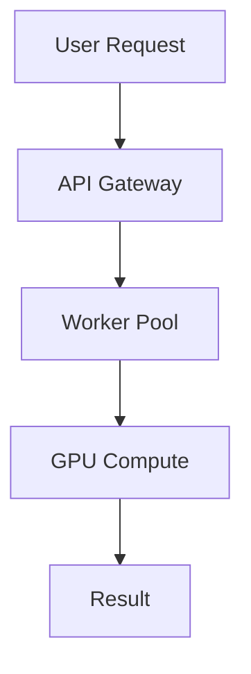

# 📝 Documentation Standards

This guide establishes the documentation standards for CIRO Network, ensuring
consistency, quality, and maintainability across all project documentation.

## 🎯 Core Principles

### Clarity First

- **Write for your audience**: Consider whether you're writing for GPU owners,
  developers, or contributors
- **Use active voice**: "Configure the worker" instead of "The worker should be
  configured"
- **Be specific**: Provide exact commands, file paths, and examples
- **Avoid jargon**: Explain technical terms or provide links to the glossary

### Completeness

- **Include all prerequisites**: List required tools, dependencies, and
  knowledge
- **Provide working examples**: All code examples must be tested and functional
- **Cover error scenarios**: Document common issues and their solutions
- **Link related content**: Connect readers to relevant sections

### Consistency

- **Follow the style guide**: Use consistent formatting, terminology, and
  structure
- **Maintain navigation**: Ensure all content is discoverable through the
  navigation
- **Use templates**: Follow established patterns for similar content types
- **Regular updates**: Keep documentation synchronized with code changes

## 📖 Writing Style

### Voice and Tone

- **Professional yet approachable**: Technical but not intimidating
- **Encouraging**: Help readers feel confident about their ability to succeed
- **Direct**: Get to the point quickly while being thorough
- **Inclusive**: Use language that welcomes all skill levels and backgrounds

### Language Guidelines

- **Use second person**: "You can configure..." instead of "One can
  configure..."
- **Present tense**: "The system processes..." instead of "The system will
  process..."
- **Parallel structure**: Maintain consistent formatting in lists and
  instructions
- **Clear headers**: Use descriptive section titles that indicate content

### Technical Writing Best Practices

- **Lead with the most important information**
- **Use numbered lists for sequential steps**
- **Use bulleted lists for feature lists or requirements**
- **Include code examples for all technical instructions**
- **Provide both conceptual overviews and detailed implementations**

## 🏗️ Document Structure

### Page Template

Every documentation page should follow this structure:

```markdown
# Page Title

Brief introduction explaining what this page covers and who it's for.

## 🎯 Prerequisites

- List required knowledge
- List required tools
- Link to setup instructions

## 📋 Overview

High-level explanation of concepts covered.

## 🚀 Main Content

Detailed instructions, explanations, and examples.

### Subsection

More specific content.

## 💡 Examples

Working code examples with explanations.

## ⚠️ Troubleshooting

Common issues and solutions.

## 🔗 Related Resources

- [Link to related documentation]()
- [External resources]()

## 📝 Next Steps

What to read or do next.
```

### Section Ordering

1. **Introduction**: Brief overview and target audience
2. **Prerequisites**: What readers need before starting
3. **Concepts**: High-level explanations
4. **Implementation**: Step-by-step instructions
5. **Examples**: Working code samples
6. **Troubleshooting**: Common issues
7. **References**: Related links and resources

## 🎨 Formatting Standards

### Headers

- Use title case for page titles: "Getting Started with CIRO Network"
- Use sentence case for section headers: "Installing the desktop application"
- Include relevant emojis in headers to improve scannability
- Maintain consistent hierarchy (H1 → H2 → H3, don't skip levels)

### Code Formatting

#### Inline Code

Use backticks for:

- File names: `package.json`
- Commands: `cargo build`
- Variables: `API_KEY`
- Short code snippets: `let result = compute(input);`

#### Code Blocks

Use fenced code blocks with language specification:

```rust
// Rust example with comments
use ciro_network::{Worker, ComputeRequest};

async fn process_job(request: ComputeRequest) -> Result<Output, Error> {
    let worker = Worker::new().await?;
    worker.execute(request).await
}
```

```bash
# Shell commands with comments
cargo build --release
./target/release/ciro-worker --config worker.toml
```

#### File Paths

- Use forward slashes for all paths: `src/lib.rs`
- Include full paths from project root when relevant
- Use proper casing matching the actual file system

### Links

- **Internal links**: Use relative paths:
  `[Setup Guide](../development/setup.md)`
- **External links**: Use full URLs with descriptive text
- **API references**: Link to specific sections when possible
- **Code links**: Link to GitHub when referencing specific implementations

### Lists and Formatting

- Use **bold** for emphasis on key terms
- Use _italics_ for notes or less important clarifications
- Use `inline code` for technical terms and file names
- Use > blockquotes for important notes or warnings

### Admonitions

Use admonitions for special content:

```markdown
<div class="admonition note">
<p class="admonition-title">📝 Note</p>
<p>Additional information that helps but isn't required.</p>
</div>

<div class="admonition tip">
<p class="admonition-title">💡 Tip</p>
<p>Helpful advice or best practices.</p>
</div>

<div class="admonition warning">
<p class="admonition-title">⚠️ Warning</p>
<p>Important information about potential issues.</p>
</div>

<div class="admonition danger">
<p class="admonition-title">🚨 Danger</p>
<p>Critical information about security or data loss risks.</p>
</div>
```

## 📊 Visual Elements

### Diagrams

- Use Mermaid for system diagrams, flowcharts, and sequences
- Include alt text for accessibility
- Provide text descriptions for complex diagrams
- Use consistent colors and styling



### Images

- Use PNG format for screenshots
- Use SVG format for icons and simple graphics
- Include descriptive alt text
- Optimize for both light and dark themes when possible

### Tables

- Use tables for structured data comparison
- Include headers for all columns
- Keep tables simple and readable
- Consider mobile responsiveness

| Component       | Language   | Purpose        |
| --------------- | ---------- | -------------- |
| Smart Contracts | Cairo      | On-chain logic |
| Worker Node     | Rust       | GPU management |
| Desktop App     | TypeScript | User interface |

## 🔧 Technical Documentation

### API Documentation

- **Auto-generated**: Use rustdoc, JSDoc, or similar tools
- **Manual enhancement**: Add usage examples and context
- **Version tracking**: Document API changes and deprecations
- **Error handling**: Document all possible error responses

### Code Examples

- **Complete examples**: Include all necessary imports and setup
- **Tested examples**: Verify all examples work with current codebase
- **Commented code**: Explain non-obvious parts
- **Multiple scenarios**: Show different use cases

### Architecture Documentation

- **C4 Model**: Use Context, Container, Component, and Code diagrams
- **Decision records**: Document architectural decisions and rationale
- **Trade-offs**: Explain choices and alternatives considered
- **Evolution**: Document how architecture has changed over time

## 🧪 Testing Documentation

### Code Example Validation

All code examples must be:

- Syntactically correct
- Functionally tested
- Up-to-date with current APIs
- Documented with expected outputs

### Documentation Testing

- **Link checking**: Verify all internal and external links work
- **Spell checking**: Use automated tools for grammar and spelling
- **Accessibility**: Ensure content is accessible to screen readers
- **Mobile testing**: Verify content renders well on mobile devices

## 📋 Content Guidelines

### Tutorials

- **Step-by-step**: Break complex tasks into manageable steps
- **Progressive complexity**: Start simple, build to advanced concepts
- **Checkpoint validation**: Allow readers to verify progress
- **Troubleshooting**: Include common pitfalls and solutions

### Reference Documentation

- **Comprehensive coverage**: Document all public APIs and features
- **Searchable**: Use clear, descriptive headers and keywords
- **Cross-referenced**: Link between related concepts
- **Version-specific**: Clearly indicate version compatibility

### User Guides

- **Task-oriented**: Focus on what users want to accomplish
- **Multiple paths**: Acknowledge different approaches to problems
- **Context-aware**: Provide information relevant to user's situation
- **Outcome-focused**: Clearly state what users will achieve

## 🔄 Maintenance Process

### Regular Reviews

- **Quarterly reviews**: Check for outdated information
- **Release updates**: Update documentation with each release
- **User feedback**: Incorporate suggestions and corrections
- **Analytics**: Use documentation metrics to identify improvement areas

### Version Control

- **Branch strategy**: Create documentation branches for major changes
- **Change tracking**: Document what changed and why
- **Release notes**: Include documentation changes in release notes
- **Archive old versions**: Maintain historical documentation when needed

### Collaboration

- **Review process**: All documentation changes require review
- **Style consistency**: Maintain consistent voice and formatting
- **Technical accuracy**: Verify technical content with domain experts
- **User testing**: Test documentation with actual users when possible

## 🎯 Quality Checklist

Before publishing any documentation:

### Content Quality

- [ ] Accurate and up-to-date information
- [ ] Clear target audience identification
- [ ] Complete coverage of the topic
- [ ] Logical organization and flow
- [ ] Working code examples
- [ ] Proper grammar and spelling

### Technical Quality

- [ ] All links work correctly
- [ ] Code examples are tested
- [ ] Screenshots are current
- [ ] Formatting is consistent
- [ ] Mobile-friendly layout
- [ ] Accessibility compliance

### User Experience

- [ ] Clear navigation path
- [ ] Appropriate difficulty level
- [ ] Sufficient context and background
- [ ] Helpful examples and use cases
- [ ] Troubleshooting information included
- [ ] Next steps clearly identified

## 📚 Templates

### API Reference Template

````markdown
# API Method Name

Brief description of what this API method does.

## Parameters

| Parameter | Type   | Required | Description              |
| --------- | ------ | -------- | ------------------------ |
| `param1`  | string | Yes      | Description of parameter |

## Response

Description of response format.

```json
{
  "example": "response"
}
```
````

## Examples

### Basic Usage

```rust
// Rust example
```

### Error Handling

```rust
// Error handling example
```

## Error Codes

| Code | Description | Resolution       |
| ---- | ----------- | ---------------- |
| 400  | Bad Request | Check parameters |

````

### Tutorial Template
```markdown
# Tutorial Title

What you'll learn and build in this tutorial.

## 🎯 Prerequisites

- Required knowledge
- Required tools
- Time estimate

## 🏗️ Overview

What we'll build and the steps involved.

## 📋 Step 1: Setup

Detailed instructions for first step.

## 📋 Step 2: Implementation

Continue with next steps...

## 🧪 Testing

How to verify everything works.

## 🎉 Conclusion

Summary of what was accomplished and next steps.
````

---

_Remember: Great documentation is not just about providing information—it's
about empowering users to achieve their goals efficiently and confidently._
