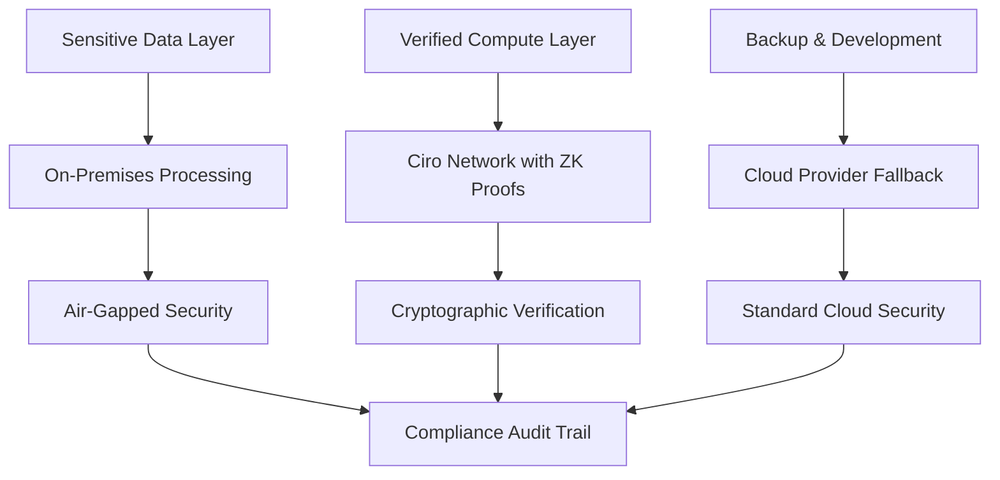

# Enterprise Overview

**Ciro Network transforms industrial AI infrastructure, reducing compute costs by 70% while providing cryptographic verification and regulatory compliance.** Built by engineers who deploy AI in real manufacturing plants, we solve the fundamental challenges that prevent enterprises from scaling AI operations.

## 🏭 **Built for Industrial Reality**

### **Our Enterprise Heritage**

**Ciro AI Labs** has deployed computer vision systems in:
- **Manufacturing plants**: 24/7 safety monitoring and quality control
- **Oil & gas facilities**: Pipeline monitoring and leak detection  
- **Mining operations**: Equipment safety and operational efficiency
- **Power plants**: Predictive maintenance and compliance monitoring

This real-world experience revealed the **infrastructure problems** that enterprise AI faces today.

### **The Enterprise AI Challenge**

**Traditional Approach:**
```
Cloud-Only Strategy Problems:
• Unpredictable costs: $15K → $60K surge bills
• Regulatory constraints: Sensitive data cannot leave premises  
• Performance issues: High latency, network dependencies
• Vendor lock-in: Limited negotiation power with Big Tech
• Security gaps: No verification of computation correctness
• Compliance burden: Manual audit trails and reporting
```

**Ciro Network Solution:**
```
Hybrid Infrastructure Approach:
• Predictable costs: 70-80% reduction in total compute spend
• Regulatory compliance: On-premises + ZK verification + cloud fallback
• Enterprise performance: <100ms latency, 99.99% uptime SLAs
• Vendor neutrality: Multiple providers, open standards
• Cryptographic security: ZK-ML proofs for verifiable AI
• Automated compliance: Built-in audit trails and reporting
```

## 💰 **Total Cost of Ownership (TCO) Analysis**

### **Traditional Enterprise AI Costs**

**Large Manufacturing Plant (500+ employees):**
```
Annual AI Infrastructure Costs:

Hardware Option:
• GPU servers (4x H100): $120K upfront
• Maintenance & support: $25K/year  
• Facilities & power: $15K/year
• Personnel (2 FTE): $200K/year
• Total Year 1: $360K

Cloud Option:
• Baseline compute: $20K/month
• Surge capacity: $50K/month (4-6 times/year)  
• Data transfer: $3K/month
• Support contracts: $8K/month
• Total Annual: $544K
```

### **Ciro Network Hybrid Approach**

**Same Manufacturing Plant with Ciro Network:**
```
Optimized Hybrid Infrastructure:

On-Premises (Baseline):
• Existing GPU capacity: $0 marginal cost
• Ciro Network integration: $2K setup

Network Capacity (Surge):
• Surge compute: $8K/month equivalent
• ZK verification: $500/month
• Network fees: $300/month  

Cloud Fallback (Emergency):
• Emergency backup: $1K/month
• Development/testing: $800/month

Total Annual Cost: $130K
Annual Savings: $414K (76% reduction)
```

### **ROI Calculation by Enterprise Size**

| Organization Size | Traditional Costs | Ciro Network Costs | Annual Savings | ROI |
|------------------|-------------------|-------------------|----------------|-----|
| **Small Plant** (100 employees) | $180K | $65K | $115K | **64%** |
| **Medium Facility** (500 employees) | $544K | $130K | $414K | **76%** |
| **Large Enterprise** (2000+ employees) | $2.1M | $480K | $1.6M | **78%** |
| **Multi-Site Operation** | $8.5M | $1.8M | $6.7M | **79%** |

## 🛡️ **Enterprise Security & Compliance**

### **Regulatory Requirements We Address**

**Manufacturing & Industrial:**
- **ISO 27001**: Information security management
- **SOC 2 Type II**: Service organization controls
- **NIST Cybersecurity Framework**: Risk management
- **Industry 4.0 Standards**: Smart manufacturing security

**Sector-Specific Compliance:**
- **Healthcare**: HIPAA, FDA 21 CFR Part 11
- **Financial**: SOX, PCI DSS, GDPR
- **Energy**: NERC CIP, FERC regulations
- **Defense**: ITAR, FedRAMP, CMMC

### **Security Architecture**

**Three-Layer Security Model:**


**ZK-ML Verification Benefits:**
- **Cryptographic proof** that AI computations were performed correctly
- **Audit trails** for regulatory reporting and compliance  
- **Tamper detection** for mission-critical applications
- **Legal protection** with mathematical evidence of due diligence

## 📊 **Enterprise Features & SLAs**

### **Performance Guarantees**

| Metric | Standard | Enterprise | Critical |
|--------|----------|------------|----------|
| **Latency** | <500ms | <100ms | <50ms |
| **Uptime** | 99.5% | 99.9% | 99.99% |
| **Support Response** | 24hr | 4hr | 1hr |
| **Verification** | Statistical | ZK-Proof | Full ZK-ML |

### **Enterprise-Only Features**

**🏢 Dedicated Infrastructure:**
- Reserved GPU capacity for guaranteed availability
- Geographic preferences for data sovereignty  
- Custom SLAs tailored to your industry requirements
- Dedicated support team with industrial AI expertise

**🔐 Advanced Security:**
- Private network endpoints for sensitive workloads
- Custom compliance reporting and audit trail generation
- Integration with enterprise identity management systems
- Advanced threat detection and incident response

**📈 Operations & Management:**
- Real-time cost monitoring and budget controls
- Predictive capacity planning and auto-scaling
- Advanced analytics and performance optimization
- White-label deployment options for customer-facing applications

**⚖️ Legal & Compliance:**
- Custom data processing agreements (DPAs)
- Industry-specific compliance certifications
- Legal review of AI computation verification
- Insurance and liability coverage options

## 🚀 **Implementation Roadmap**

### **Phase 1: Assessment & Planning (2-4 weeks)**

**Current State Analysis:**
- [ ] AI workload audit and cost analysis
- [ ] Regulatory and compliance requirement mapping
- [ ] Performance and latency requirement documentation
- [ ] Security and data sovereignty assessment

**Solution Design:**
- [ ] Hybrid infrastructure architecture design
- [ ] Integration points and API requirements
- [ ] Migration planning and timeline
- [ ] Risk assessment and mitigation strategies

### **Phase 2: Pilot Deployment (4-8 weeks)**

**Non-Critical Workloads:**
- [ ] Quality control and efficiency optimization systems
- [ ] Non-sensitive computer vision applications
- [ ] Predictive maintenance for non-safety-critical equipment
- [ ] Performance validation and cost measurement

**Validation & Testing:**
- [ ] ZK-proof verification testing and validation
- [ ] Compliance audit trail generation and review
- [ ] Integration testing with existing systems
- [ ] Security penetration testing and validation

### **Phase 3: Production Rollout (8-16 weeks)**

**Mission-Critical Systems:**
- [ ] Safety monitoring and emergency response systems
- [ ] Regulatory compliance and reporting systems
- [ ] Real-time operations and control systems
- [ ] Full enterprise integration and scaling

**Optimization & Enhancement:**
- [ ] Performance tuning and cost optimization
- [ ] Advanced feature enablement and customization
- [ ] Staff training and knowledge transfer
- [ ] Ongoing support and maintenance planning

## 💼 **Pricing & Packages**

### **Enterprise Packages**

**🏭 Industrial Starter**
*Best for single facilities or pilot programs*
- Up to 100 GPU hours/month
- Basic ZK verification
- Email support (24hr response)
- Standard compliance reporting
- **$2,500/month**

**🏢 Enterprise Standard**  
*Best for medium-large facilities*
- Up to 1,000 GPU hours/month
- Full ZK-ML verification
- Phone & email support (4hr response)
- Custom compliance reporting
- Dedicated account manager
- **$8,500/month**

**🌐 Enterprise Premium**
*Best for multi-site operations*
- Unlimited GPU hours
- Advanced ZK verification & audit trails
- 24/7 priority support (1hr response)
- Custom SLAs and compliance
- Dedicated support team
- White-label options
- **Custom pricing**

### **Volume Discounts**

- **Multi-year contracts**: 15-25% discount
- **Multi-site deployments**: 20-30% discount  
- **Strategic partnerships**: Custom pricing available
- **Academic & research**: 50% discount

## 🤝 **Getting Started**

### **Immediate Next Steps**

**1. Schedule Assessment Call**
- [Book consultation](https://calendly.com/ciro-network/enterprise-consultation) with our industrial AI specialists
- Review your current AI infrastructure and challenges
- Discuss regulatory requirements and compliance needs
- Get personalized ROI analysis and deployment timeline

**2. Technical Evaluation**
- Access to enterprise sandbox environment
- Proof-of-concept development with your actual workloads  
- Integration testing with your existing systems
- Performance and cost analysis with real data

**3. Pilot Program**
- 90-day pilot with full enterprise features
- Dedicated technical support and implementation assistance
- Success metrics tracking and optimization
- Migration planning for full production deployment

### **Contact Enterprise Team**

**Sales & Partnership Inquiries:**
- 📧 [enterprise@ciro.network](mailto:enterprise@ciro.network)
- 📞 +1 (555) 123-4567
- 📅 [Schedule Call](https://calendly.com/ciro-network/enterprise-consultation)

**Technical & Integration Support:**
- 📧 [integrations@ciro.network](mailto:integrations@ciro.network)
- 💬 [Enterprise Discord](https://discord.gg/ciro-enterprise)
- 📚 [Technical Documentation](../api-reference/rest-apis.md)

**Compliance & Legal:**
- 📧 [compliance@ciro.network](mailto:compliance@ciro.network)
- 📄 [Legal Documentation](../legal/compliance.md)
- 🔒 [Security Overview](../architecture/security.md)

---

**Ready to reduce your AI infrastructure costs by 70%?** Our industrial AI specialists are standing by to design your hybrid infrastructure strategy and demonstrate the immediate cost savings potential for your organization.
