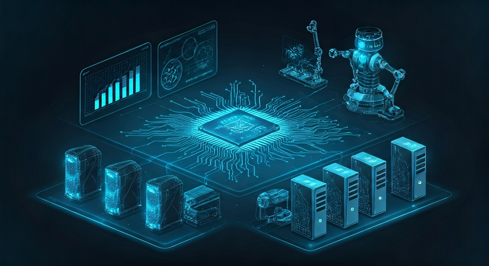
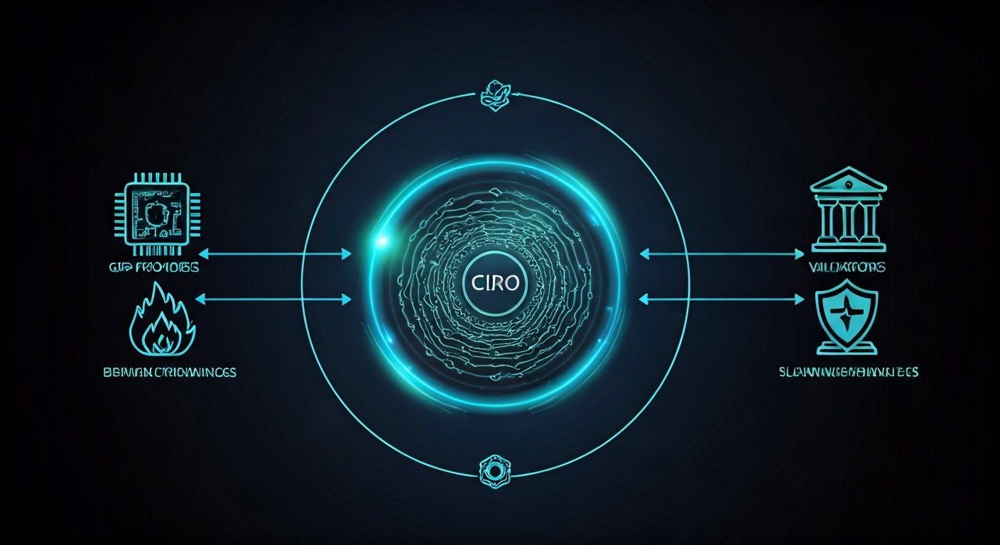

# 👋 Welcome to Ciro Network!

**We’re so glad you’re here.** Whether you’re a developer, GPU provider, researcher, or just curious about the future of decentralized AI, you belong in the Ciro community.

---

## 🌱 Our Story: Built for Real-World Needs

Ciro Network was born on the factory floor—not in a hackathon or a hype cycle. Our team at **Ciro AI Labs** built real-time vision models and ETL pipelines for industrial plants and operations teams across Latin America. We saw firsthand how unpredictable cloud costs and limited access to high-end GPUs could hold back innovation and safety in critical environments.

> Not every plant can afford H100s or access AWS. Not every team has the luxury of elastic cloud budgets. And during compute surges, costs become unpredictable and unsustainable.

So we built Ciro Network—first, for ourselves. We needed a way to:
- Offload inference and training jobs from local edge servers
- Balance GPU workloads across regions and machines
- Cap our AWS/Azure spend while maintaining performance

What started as an internal optimization layer became something much bigger: a decentralized compute infrastructure with GPU orchestration, on-chain settlement, ZK-ML verification, and a full tokenomics engine for staking, slashing, and rewards.

Now, we’re opening it to the world—so others can do what we did: **Run high-performance AI workloads without Big Cloud dependencies.**

Ciro Network is built **by practitioners, for practitioners**—an infrastructure layer born from real needs, not hype.

---

## 🤗 You’re Invited

Ciro is for everyone who believes in open, verifiable, and accessible AI. Whether you want to build, contribute, learn, or just explore, you’re welcome here. Our community is global, inclusive, and always ready to help.

- **New to Web3 or AI?** No problem—our guides and community are here for you.
- **Seasoned developer or GPU pro?** Dive in and help shape the future.
- **Curious about decentralized infrastructure?** You’re in the right place.

---

# 🚀 Getting Started with Ciro Network


**TL;DR**: Start building verifiable AI applications on Ciro Network in under 10 minutes with our SDK, templates, and comprehensive testnet environment.

## 🎯 Choose Your Path


Ciro Network serves three primary audiences, each with tailored onboarding paths:

---

## 🌐 **Multichain Infrastructure**

Ciro Network is built for the **multichain future**—while our core compute coordination runs on Starknet for maximum performance and verifiability, we support cross-chain settlements and staking across multiple ecosystems.

### **Why Multichain Matters for AI Compute**

- **Flexibility**: Choose the settlement chain that fits your use case and budget
- **Accessibility**: Stake and earn on the network that aligns with your existing holdings
- **Scalability**: Distribute demand across multiple chains to reduce congestion
- **Enterprise Ready**: Settle high-value jobs on Ethereum mainnet for maximum security

### **Supported Networks**

| Network | Purpose | Status | Best For |
|---------|---------|--------|----------|
| **🟣 Starknet** | Core coordination, job management | ✅ **Live** | AI developers, zkML applications |
| **🔵 Ethereum** | Institutional staking, high-value settlements | 🚧 **Q2 2025** | Enterprise users, large settlements |
| **🟠 Polygon** | Retail staking, frequent settlements | 🚧 **Q2 2025** | DApps, gaming, high-frequency use |
| **🔴 Arbitrum** | DeFi integrations, bridge settlements | 🚧 **Q3 2025** | DeFi protocols, yield farming |
| **🟡 Base** | Consumer app settlements | 🔄 **Planned** | Consumer applications, social |

> 💡 **How it works**: Submit AI jobs on Starknet for fastest execution and verifiable results, then settle payments on your preferred chain using our trustless bridge infrastructure.

---

### 🧠 **AI/ML Developers**
Build verifiable AI applications with zkML proofs
- **Goal**: Deploy AI models with cryptographic verification
- **Time**: 15 minutes to first verifiable inference
- **Prerequisites**: Python/Node.js, basic ML experience

### ⚡ **GPU Providers** 
Contribute compute resources and earn $CIRO tokens
- **Goal**: Start earning from your GPU hardware
- **Time**: 30 minutes to join the network
- **Prerequisites**: Modern GPU (RTX 3080+ or equivalent)

### 🔗 **Starknet Developers**
Integrate AI oracles and verification into Cairo smart contracts
- **Goal**: Use AI results in on-chain applications  
- **Time**: 20 minutes to first smart contract integration
- **Prerequisites**: Cairo/Starknet development experience

---

## 🧠 Path 1: AI/ML Developer Quick Start

Transform your AI models into verifiable, decentralized applications in just a few steps. No complex setup required—just install, configure, and deploy.

---

### 🔧 **Step 1: Install the Ciro SDK**

Choose your preferred language and get started immediately:

**For JavaScript/TypeScript developers:**
```bash
npm install @ciro-network/sdk
```

**For Python developers:**
```bash
pip install ciro-sdk
```

**Create your first project:**
```bash
npx create-ciro-app my-ai-app
cd my-ai-app
```

> ✅ **What you just did:** Installed the Ciro SDK and created a new project with all the necessary boilerplate code.

---

### ⚙️ **Step 2: Configure Your Environment**

Create a simple configuration file to connect to the Ciro testnet:

**Create `ciro.config.js`:**
```javascript
export default {
  network: "testnet",
  apiKey: process.env.CIRO_API_KEY,
  verificationLevel: "zkml",
  defaultTimeout: 30000
}
```

**Get your API key:**
1. Visit [faucet.testnet.ciro.network](https://faucet.testnet.ciro.network)
2. Connect your wallet
3. Get free testnet tokens + API key

> ✅ **What you just did:** Connected your app to Ciro's testnet where you can experiment safely.

---

### 🚀 **Step 3: Deploy Your First AI Model**

Let's deploy a simple image classifier that generates cryptographic proofs:

**Create `deploy-model.py`:**
```python
from ciro_sdk import CiroClient, ModelConfig

# Connect to Ciro Network
client = CiroClient(network="testnet")

# Configure your model
model_config = ModelConfig(
    framework="pytorch",
    model_path="./models/resnet50.pth",
    input_shape=(3, 224, 224),
    verification="zkml"
)

# Deploy to the network
deployment = client.deploy_model(model_config)
print(f"🎉 Model deployed successfully!")
print(f"📋 Model ID: {deployment.model_id}")
print(f"🔗 View in explorer: https://explorer.testnet.ciro.network/models/{deployment.model_id}")
```

**Run the deployment:**
```bash
python deploy-model.py
```

> ✅ **What you just did:** Uploaded your AI model to Ciro's decentralized network where it can be used by anyone with verifiable results.

---

### 🎯 **Step 4: Run Verifiable Inference**

Now let's use your deployed model to make predictions with cryptographic proofs:

**Create `run-inference.py`:**
```python
# Load your image
import torch
from PIL import Image

image = Image.open("test-image.jpg")
image_tensor = transform(image)

# Run inference with proof generation
result = client.infer(
    model_id="your_model_id_here",
    input_data=image_tensor,
    generate_proof=True
)

# See your results
print(f"🎯 Prediction: {result.output}")
print(f"📊 Confidence: {result.confidence}%")
print(f"🔐 ZK Proof: Generated ✅")

# Verify the proof (optional but cool!)
is_valid = client.verify_proof(
    result.proof, 
    result.output, 
    "your_model_id_here"
)
print(f"✅ Proof verification: {'VALID' if is_valid else 'INVALID'}")
```

> ✅ **What you just did:** Made an AI prediction that anyone can verify is correct without seeing your model or data.

---

### 📈 **What to Expect: Performance Metrics**

| Model Type | Latency | Proof Overhead | Use Cases |
|------------|---------|----------------|-----------|
| **Simple Models** (LogReg, SVM) | 150-300ms | +50ms | Real-time classification |
| **Image Models** (ResNet, EfficientNet) | 300-800ms | +100ms | Computer vision |
| **Transformers** (BERT, GPT) | 1-5 seconds | +200ms | NLP applications |

**Network Reliability:** 99.7% consensus accuracy on testnet

---

## ⚡ Path 2: GPU Provider Quick Start

Turn your idle GPU into a money-making machine by providing compute power to AI developers. Join thousands of providers earning $CIRO tokens across multiple chains.

---

### 🖥️ **Step 1: Check Your Hardware**

**Minimum Requirements (Entry Level):**
- **GPU**: NVIDIA RTX 3080 / AMD RX 6800 XT
- **VRAM**: 10GB+ 
- **RAM**: 16GB system memory
- **Storage**: 100GB free SSD space
- **Internet**: 100 Mbps up/down, <50ms latency

**Recommended for Higher Earnings:**
- **Enterprise GPUs**: H100, A100, V100 series
- **Multiple GPUs**: 2-8 GPU setups earn tier bonuses
- **Fast Internet**: 1Gbps+ for premium workloads

> 💡 **Earning Potential:** RTX 3080 = $0.40-0.80/hour | H100 = $2.20-4.50/hour

---

### 📦 **Step 2: Install Ciro Worker**

**Quick Installation (Recommended):**
```bash
curl -fsSL https://install.ciro.network | sh
```

**Or build from source:**
```bash
git clone https://github.com/ciro-network/ciro-worker
cd ciro-worker
cargo build --release
```

**Verify installation:**
```bash
ciro-worker --version
```

> ✅ **What you just did:** Installed the Ciro worker software that will manage your GPU and connect to the network.

---

### ⚙️ **Step 3: Configure Your Worker**

**Create your configuration file:**

**Create `config/worker.toml`:**
```toml
[network]
starknet_rpc = "https://starknet-mainnet.public.blastapi.io"
coordinator_endpoint = "ws://coordinator.testnet.ciro.network"

[hardware]
gpu_ids = [0, 1]          # Which GPUs to use
max_jobs_concurrent = 4   # How many jobs at once
enable_zkml = true        # Higher rewards for zkML jobs

[economic]
min_stake = 1000          # CIRO tokens to stake
commission_rate = 0.05    # 5% network fee
auto_restake = true       # Compound your earnings
```

**Test your hardware:**
```bash
ciro-worker check-hardware
```

This will show you:
- ✅ Compatible GPUs detected
- ✅ Performance tier assignment  
- ✅ Estimated earning potential

> ✅ **What you just did:** Configured your worker to use your GPUs optimally and checked compatibility.

---

### 🪙 **Step 4: Get CIRO Tokens & Stake**

**Get testnet tokens:**
1. Visit [faucet.testnet.ciro.network](https://faucet.testnet.ciro.network)
2. Connect your Starknet wallet
3. Request 2000 testnet CIRO tokens

**Choose your staking chain:**

| Chain | Min Stake | APY Range | Best For |
|-------|-----------|-----------|----------|
| **Starknet** | 1K CIRO | 12-18% | Native rewards, governance |
| **Ethereum** | 10K CIRO | 8-12% | Institutional security |
| **Polygon** | 500 CIRO | 10-15% | Low fees, retail-friendly |

**Stake your tokens:**
```bash
# Stake on Starknet (default, highest rewards)
ciro-worker stake --amount 1000 --duration 90d --chain starknet

# Or stake on Ethereum for institutional security
ciro-worker stake --amount 10000 --duration 90d --chain ethereum

# Or stake on Polygon for lower minimum
ciro-worker stake --amount 500 --duration 90d --chain polygon
```

**Check your multi-chain stake:**
```bash
ciro-worker status --all-chains
```

> ✅ **What you just did:** Staked tokens as collateral across your preferred chain(s), making you eligible for high-value jobs and protecting the network.

---

### 🚀 **Step 5: Start Earning**

**Start your worker:**
```bash
ciro-worker start --daemon
```

**Monitor your earnings:**
```bash
# View real-time stats
ciro-worker dashboard

# Check earnings history  
ciro-worker earnings --last-week
```

**What you'll see:**
```text
🔥 Ciro Worker Dashboard
━━━━━━━━━━━━━━━━━━━━━━━━━━━━━━━━━━━━━━━━━━━━━━━━━━━━━━━━━

Status: 🟢 ONLINE        Jobs Completed: 47
Uptime: 23h 45m          Earnings Today: 12.4 CIRO
GPU Temp: 67°C           Total Staked: 1000 CIRO

Recent Jobs:
  ✅ Image Classification    +0.8 CIRO    3 min ago
  ✅ Text Generation        +2.1 CIRO    7 min ago  
  ✅ zkML Proof Generation  +3.5 CIRO    12 min ago
```

> ✅ **What you just did:** Started earning CIRO tokens by providing compute power to AI developers worldwide!

---

### 💰 **Earning Expectations**

| GPU Tier | Hourly Rate | Monthly (24/7) | Annual (24/7) |
|-----------|-------------|----------------|---------------|
| **RTX 3080** | $0.40-0.80 | $288-576 | $3,456-6,912 |
| **RTX 4090** | $0.80-1.60 | $576-1,152 | $6,912-13,824 |
| **A100** | $1.50-3.00 | $1,080-2,160 | $12,960-25,920 |
| **H100** | $2.20-4.50 | $1,584-3,240 | $19,008-38,880 |

**Bonus Multipliers:**
- 🔐 **zkML Jobs**: +50% premium
- 🏆 **High Uptime**: +25% (>99% uptime)
- 🔥 **Multi-GPU**: +10% per additional GPU
- ⚡ **Fast Response**: +15% (sub-200ms)

**Network Fees:**
- 5-10% commission to coordinator
- Gas fees covered by requesters

---

## 🔗 Path 3: Starknet Developer Integration

Build AI-powered smart contracts with verifiable results. Perfect for DeFi protocols, DAOs, and any dApp that needs trustless AI oracles.

---

### 🛠️ **Step 1: Set Up Your Development Environment**

**Install required tools:**
```bash
# Install Scarb (Cairo package manager)
curl --proto '=https' --tlsv1.2 -sSf https://docs.swmansion.com/scarb/install.sh | sh

# Install Starknet Foundry
curl -L https://raw.githubusercontent.com/foundry-rs/starknet-foundry/master/scripts/install.sh | sh
```

**Create your project:**
```bash
scarb new ai-oracle-project
cd ai-oracle-project
```

**Add Ciro dependency to `Scarb.toml`:**
```toml
[dependencies]
starknet = ">=2.6.3"
ciro_interfaces = { git = "https://github.com/ciro-network/cairo-contracts" }
```

> ✅ **What you just did:** Set up a Cairo development environment with Ciro's smart contract interfaces.

---

### 📝 **Step 2: Create Your AI Oracle Contract**

Let's build a simple but powerful AI oracle that can verify predictions on-chain:

**Create `src/ai_oracle.cairo`:**
```cairo
#[starknet::contract]
mod AIOracle {
    use starknet::ContractAddress;
    use ciro_interfaces::IProofVerifier;
    
    #[storage]
    struct Storage {
        proof_verifier: ContractAddress,
        authorized_models: LegacyMap<felt252, bool>,
        owner: ContractAddress,
    }
    
    #[constructor]
    fn constructor(
        ref self: ContractState,
        proof_verifier: ContractAddress,
        owner: ContractAddress
    ) {
        self.proof_verifier.write(proof_verifier);
        self.owner.write(owner);
    }
    
    #[external(v0)]
    fn verify_ai_prediction(
        ref self: ContractState,
        model_id: felt252,
        input_hash: felt252,
        prediction: felt252,
        proof: Array<felt252>
    ) -> bool {
        // Verify the zkML proof on-chain
        let verifier = IProofVerifierDispatcher { 
            contract_address: self.proof_verifier.read() 
        };
        
        verifier.verify_inference_proof(
            model_id, 
            input_hash, 
            prediction, 
            proof
        )
    }
    
    #[external(v0)]
    fn authorize_model(ref self: ContractState, model_id: felt252) {
        assert(get_caller_address() == self.owner.read(), 'Only owner');
        self.authorized_models.write(model_id, true);
    }
}
```

> ✅ **What you just did:** Created a smart contract that can verify AI predictions using zero-knowledge proofs.

---

### 🚀 **Step 3: Deploy Your Contract**

**Configure your deployment in `.env`:**
```bash
STARKNET_RPC=https://starknet-sepolia.public.blastapi.io
ACCOUNT_ADDRESS=0x1234...  # Your account address
PRIVATE_KEY=0x5678...      # Your private key
PROOF_VERIFIER=0xabcd...   # Ciro's proof verifier address
```

**Deploy your contract:**
```bash
# Compile your contract
scarb build

# Deploy to Starknet testnet
starknet deploy \
  --class-hash $(scarb build --target scarb_build | grep -o '0x[a-fA-F0-9]*') \
  --constructor-calldata $PROOF_VERIFIER $ACCOUNT_ADDRESS \
  --network testnet
```

**Save your contract address:**
```bash
export AI_ORACLE_ADDRESS=0x789a...  # Your deployed contract address
```

> ✅ **What you just did:** Deployed your AI oracle contract to Starknet testnet where it can verify AI predictions.

---

### 🎯 **Step 4: Build Real-World Applications**

Now let's see some practical examples of what you can build:

**Example 1: DeFi Risk Assessment**
```cairo
#[external(v0)]
fn assess_loan_risk(
    ref self: ContractState,
    borrower_data_hash: felt252,
    ai_proof: Array<felt252>
) -> u8 {
    // Verify AI computed the risk score correctly
    let is_valid = self.verify_ai_prediction(
        RISK_MODEL_ID,      // Pre-trained risk model
        borrower_data_hash, // Hash of borrower's data
        risk_score,         // AI's prediction (1-100)
        ai_proof           // Zero-knowledge proof
    );
    
    assert(is_valid, 'Invalid AI proof');
    risk_score
}
```

**Example 2: DAO Governance with AI Insights**
```cairo
#[external(v0)]
fn create_proposal_with_analysis(
    ref self: ContractState,
    proposal_data: felt252,
    impact_analysis: felt252,
    ai_proof: Array<felt252>
) -> felt252 {
    // Verify AI analysis is correct
    let analysis_valid = self.verify_ai_prediction(
        GOVERNANCE_MODEL_ID,
        proposal_data,
        impact_analysis,
        ai_proof
    );
    
    assert(analysis_valid, 'Invalid impact analysis');
    
    // Create proposal with verified AI insights
    // ... rest of proposal logic
}
```

**Example 3: Cross-Chain AI Oracle Bridge**
```cairo
#[external(v0)]
fn bridge_ai_result_to_ethereum(
    ref self: ContractState,
    job_id: felt252,
    result: felt252,
    proof: Array<felt252>,
    ethereum_recipient: felt252
) {
    // Verify the AI computation on Starknet
    let is_valid = self.verify_ai_prediction(
        BRIDGE_MODEL_ID,
        job_id,
        result,
        proof
    );
    
    assert(is_valid, 'Invalid AI proof for bridging');
    
    // Bridge verified result to Ethereum
    let bridge_dispatcher = IBridgeDispatcher { 
        contract_address: self.cross_chain_bridge.read() 
    };
    
    bridge_dispatcher.send_verified_result(
        ethereum_recipient,
        result,
        proof
    );
}
```

> 💡 **Cross-Chain Benefits**: Submit AI jobs on Starknet for fastest execution, then bridge verified results to Ethereum, Polygon, or other chains for final settlement.

**Example 4: Dynamic NFT with AI**
```cairo
#[external(v0)]
fn evolve_nft(
    ref self: ContractState,
    token_id: u256,
    new_traits: felt252,
    ai_proof: Array<felt252>
) {
    // Verify AI generated valid traits
    let traits_valid = self.verify_ai_prediction(
        NFT_EVOLUTION_MODEL,
        token_id.try_into().unwrap(),
        new_traits,
        ai_proof
    );
    
    assert(traits_valid, 'Invalid trait generation');
    
    // Update NFT with AI-generated traits
    // ... NFT update logic
}
```

> ✅ **What you just did:** Learned how to integrate AI predictions into real smart contract applications.

---

### 🧪 **Step 5: Test Your Integration**

**Create tests in `tests/test_ai_oracle.cairo`:**
```cairo
use super::ai_oracle::AIOracle;

#[test]
fn test_valid_ai_proof() {
    let contract = deploy_contract();
    
    // Test with valid AI proof
    let result = contract.verify_ai_prediction(
        model_id: 'test_model',
        input_hash: 0x123,
        prediction: 0x456,
        proof: array![0x789, 0xabc]
    );
    
    assert(result == true, 'Should verify valid proof');
}
```

**Run your tests:**
```bash
scarb test
```

> ✅ **What you just did:** Created tests to ensure your AI oracle works correctly before deploying to mainnet.

---

### 📊 **Integration Benefits**

| Feature | Traditional Oracles | Ciro AI Oracles |
|---------|-------------------|------------------|
| **Trust Model** | Centralized | Cryptographically verified |
| **Data Types** | Simple price feeds | Complex AI predictions |
| **Verification** | Social consensus | Zero-knowledge proofs |
| **Latency** | 10-60 seconds | 200ms-5 seconds |
| **Cost** | $0.10-1.00 per call | $0.05-0.50 per call |

**Perfect for:**
- 🏦 **DeFi**: Credit scoring, risk assessment, yield optimization
- 🗳️ **DAOs**: Proposal analysis, community sentiment
- 🎮 **Gaming**: Dynamic content, procedural generation
- 🏥 **Insurance**: Claims processing, risk modeling

---

## 🛠️ Development Resources

### **SDKs & Tools**
- **JavaScript/TypeScript**: `@ciro-network/sdk`
- **Python**: `ciro-sdk` 
- **Cairo**: `ciro-starknet` integration library
- **CLI Tools**: `ciro-cli` for deployment and management

### **Templates & Examples**
```bash
# Clone example projects
git clone https://github.com/ciro-network/examples
```

**Available templates:**
```text
examples/
├── image-classification/    # Computer vision with zkML
├── text-analysis/          # NLP sentiment analysis  
├── defi-oracle/           # On-chain AI integration
├── federated-learning/    # Distributed training
└── nft-generation/        # Creative AI applications
```

### **Testnet Faucets**
- **CIRO Tokens**: [faucet.testnet.ciro.network](https://faucet.testnet.ciro.network)
- **Test ETH (Starknet)**: [starknet-faucet.vercel.app](https://starknet-faucet.vercel.app)

### **Monitoring & Analytics**
- **Network Explorer**: [explorer.testnet.ciro.network](https://explorer.testnet.ciro.network)
- **Real-time Metrics**: [status.ciro.network](https://status.ciro.network)
- **Job History**: Track your model performance and earnings

---

## 📊 Network Status & Performance



### **Current Testnet Metrics**
```text
Network Performance (Real-time):
  Active Workers    ████████████████ 127 nodes
  Jobs/Hour        ████████████████ 2,847 completed
  Avg Latency      ████████████████ 187ms
  Consensus Accuracy ████████████████ 99.7%
  zkML Success Rate  ████████████████ 98.1%
```

### **Geographic Distribution**
- **North America**: 45% of compute capacity
- **Europe**: 32% of compute capacity  
- **Asia Pacific**: 18% of compute capacity
- **Other Regions**: 5% of compute capacity

---

## 🚨 Important Considerations

### **Testnet vs Mainnet**
- **Current Status**: Testnet phase with experimental features
- **Mainnet Launch**: Planned Q3 2025
- **Data Persistence**: Testnet may reset periodically
- **Token Value**: Testnet CIRO has no monetary value

### **Security Recommendations**
- **Private Keys**: Never share your worker or developer private keys
- **API Keys**: Rotate API keys regularly
- **Staking**: Only stake amounts you can afford to lose in testnet
- **Smart Contracts**: Audit your contracts before mainnet deployment

### **Rate Limits**
- **Free Tier**: 100 inference requests/day
- **Developer Tier**: 10,000 requests/day ($50/month worth of testnet credits)
- **Enterprise**: Unlimited (contact for custom arrangements)

---

## 🆘 Support & Community

### **Documentation**
- **API Reference**: [docs.ciro.network/api](https://docs.ciro.network/api)
- **Cairo Integration**: [docs.ciro.network/cairo](https://docs.ciro.network/cairo)
- **zkML Guide**: [docs.ciro.network/zkml](https://docs.ciro.network/zkml)

### **Community Channels**
- **Discord**: [discord.gg/ciro-network](https://discord.gg/ciro-network) - Real-time developer support
- **GitHub**: [github.com/ciro-network](https://github.com/ciro-network) - Code, issues, contributions
- **Forum**: [forum.ciro.network](https://forum.ciro.network) - Technical discussions
- **Twitter**: [@CiroNetwork](https://twitter.com/CiroNetwork) - Updates and announcements

### **Developer Office Hours**
- **Weekly**: Thursdays 3 PM UTC
- **Format**: Live Q&A with core engineers
- **Topics**: Architecture, optimization, troubleshooting

---

## 🚀 What's Next?



### **For AI/ML Developers**
1. **Explore Advanced Models**: Try deploying transformer models and custom architectures
2. **Optimize Performance**: Learn about model optimization for distributed execution  
3. **Build Applications**: Create end-to-end dApps using verifiable AI
4. **Join Beta Programs**: Apply for early access to new features

### **For GPU Providers**
1. **Scale Your Operation**: Add more GPUs and optimize your setup
2. **Participate in Governance**: Vote on network parameters and upgrades
3. **Join Provider DAOs**: Collaborate with other providers for better efficiency
4. **Enterprise Partnerships**: Connect with large-scale projects needing dedicated compute

### **For Starknet Developers**
1. **Advanced Integrations**: Build complex AI-powered protocols
2. **Gas Optimization**: Learn efficient proof verification patterns
3. **Cross-Chain AI**: Explore multi-chain AI oracle architectures
4. **Launch Mainnet**: Prepare for production deployment

### **The Multichain Advantage**

Ciro Network isn't just another blockchain project—it's infrastructure for the **multichain future**:

- **🚀 Fastest Execution**: Submit jobs on Starknet for optimal performance
- **🔗 Flexible Settlement**: Bridge results to Ethereum, Polygon, Arbitrum, or Base
- **💰 Smart Economics**: Choose your staking chain based on risk tolerance and rewards
- **🌍 Global Access**: Build once, deploy everywhere across the crypto ecosystem

**Ready to build the future of verifiable AI?** [Choose your path above](#-choose-your-path) and start your multichain journey with Ciro Network today.
