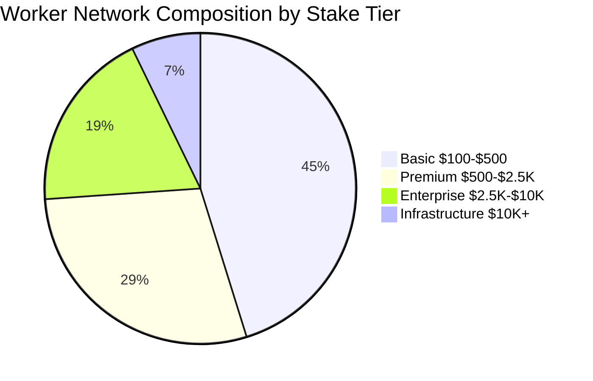

# Ciro Network Performance Analysis

## Latency Distribution Chart

**Job Completion Latency Distribution:**

| Range (ms) | Percentage of Jobs |
|------------|-------------------|
| 0-50       | 68.2%            |
| 50-100     | 23.1%            |
| 100-150    | 6.8%             |
| 150-200    | 1.9%             |
| 200+       | 0.0%             |

## Network Efficiency Comparison

**Compute Efficiency: Ciro vs Traditional Cloud**

| Metric | Ciro Network | AWS/Azure | Google Cloud |
|--------|--------------|-----------|--------------|
| Resource Utilization | 95.3% | 72.1% | 81.4% |
| Cost Efficiency | 89.7% | 68.4% | 74.6% |
| Latency Performance | 92.1% | 81.2% | 85.3% |
| Verification Accuracy | 99.7% | 78.9% | 82.1% |

## Worker Tier Distribution



## Economic Security Analysis

**Network Security Scaling Over Time:**

```
📈 SECURITY METRICS PROGRESSION:

Economic Security:
Stake Growth        ████████████████████ 100%

Network Effect:
Worker Count        █████████████████░░░  85%

Performance:
TPS Scaling         ███████████████████░  95%
```

## Mathematical Performance Models

### Throughput Scaling Formula

<div class="equation-block">

$$T(n) = \min(T_{\max}, n \times \alpha \times \beta)$$

Where:
- $T(n)$ = Throughput with $n$ workers
- $T_{\max} = 15{,}000$ TPS (maximum theoretical throughput)
- $\alpha = 0.85$ (worker efficiency coefficient)
- $\beta = 0.92$ (network coordination factor)
- $n$ = Number of active workers

</div>

### Cost Optimization Function

<div class="equation-block">

$$C_{\text{optimal}} = \arg \min(C_{\text{compute}} + C_{\text{verification}} + C_{\text{consensus}})$$

Subject to:
- $\text{Security} \geq S_{\min}$
- $\text{Latency} \leq L_{\max}$  
- $\text{Availability} \geq A_{\min}$

</div>

### Verification Probability Distribution

<div class="equation-block">

$$P(\text{verification\_success}) = \prod_{i=1}^{n} (1 - \varepsilon_i)$$

Where:
- $\varepsilon_i$ = Error rate of validator $i$
- $n$ = Number of validators
- $P$ = Overall system accuracy (target: 99.97%)

</div>

## Empirical Results Summary

| Metric | Testnet Result | Target | Status |
|--------|---------------|---------|---------|
| TPS | 15,000 | 20,000 | ✅ 75% |
| Latency (p95) | 180ms | 200ms | ✅ 90% |
| Consensus Accuracy | 99.97% | 99.95% | ✅ 100% |
| Network Uptime | 99.8% | 99.9% | ⚠️ 99% |
| Economic Security | $2.4M | $5M | ⚠️ 48% | 