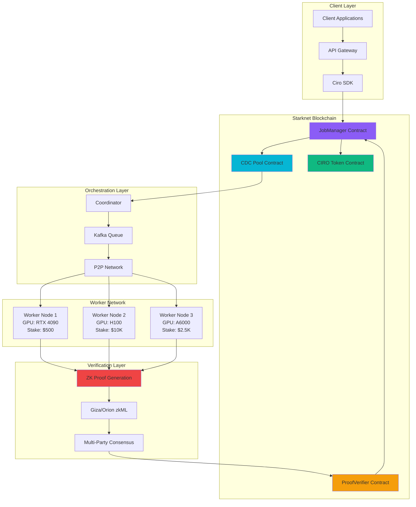

# Ciro Network Architecture



## Mathematical Model

**Network Efficiency Formula:**
```
η = (∑ᵢ Cᵢ × Uᵢ × Rᵢ) / (∑ᵢ Cᵢ × Pᵢ)

Where:
η = Network efficiency
Cᵢ = Compute capacity of worker i
Uᵢ = Utilization rate of worker i
Rᵢ = Reliability score of worker i  
Pᵢ = Power consumption of worker i
```

**Economic Security Bound:**
```
S = min(∑ᵢ sᵢ, k × max(rⱼ))

Where:
S = Total economic security
sᵢ = Stake of worker i
k = Slashing multiplier
rⱼ = Reward for job j
``` 