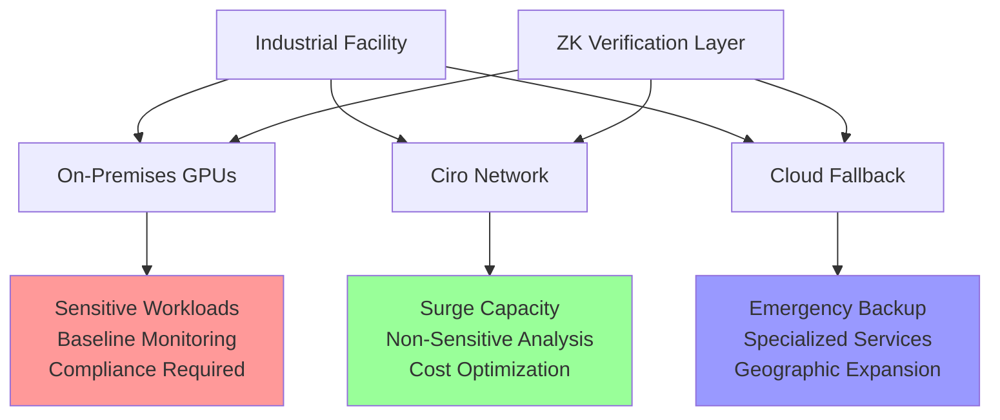

# Industrial AI Infrastructure

**Ciro Network's foundation is industrial AI.** Built by engineers who deploy computer vision systems in real manufacturing plants, oil refineries, and mining operations, we understand the unique challenges of industrial AI deployment better than any blockchain project.

## Our Industrial Heritage

### **Ciro AI Labs: Real-World Industrial AI**

Before building Ciro Network, we spent years solving actual industrial AI challenges:

**Vision Models & Data ETL Pipelines:**
- **Safety monitoring**: 24/7 monitoring of industrial equipment and personnel
- **Quality control**: Real-time defect detection on production lines
- **Predictive maintenance**: Early warning systems for equipment failure
- **Process optimization**: AI-driven efficiency improvements
- **Compliance monitoring**: Automated regulatory compliance verification

**Real Deployments:**
- **Manufacturing plants**: Computer vision for quality control and safety
- **Oil & gas facilities**: Pipeline monitoring and leak detection
- **Mining operations**: Equipment safety and operational efficiency
- **Power plants**: Predictive maintenance and safety systems

This hands-on experience revealed the **fundamental infrastructure problems** that led us to build Ciro Network.

## Industrial AI Challenges We Solve

### 💰 **Cost Management Crisis**

**The Industrial Reality:**
Industrial AI deployments have unique cost challenges that consumer-focused solutions don't address:

```
Real Industrial AI Cost Structure:

Baseline Operations (24/7 monitoring):
• 100 cameras processing: $12K/month
• Sensor data analysis: $3K/month
• Predictive models: $5K/month
• Total baseline: $20K/month

Incident Response (unpredictable surges):
• 10x camera processing for forensics: $120K/month
• Emergency analysis: $15K/month
• Crisis duration: 3-7 days
• Surge cost: $45K for single incident

Annual Impact:
• Baseline: $240K/year
• 4-6 incidents: $180-270K/year
• Total: $420-510K/year in compute costs alone
```

**Why This Matters:**
- **Safety compromises**: Plants reduce monitoring coverage to control costs
- **Delayed incident response**: Expensive analysis limits forensic capabilities
- **Innovation barriers**: Cost uncertainty prevents AI adoption
- **Competitive disadvantage**: Smaller plants can't afford enterprise AI

### 🏛️ **Regulatory & Security Requirements**

**Industrial Compliance Reality:**
Industrial operations face regulatory requirements that make standard cloud solutions inadequate:

**Data Sovereignty Requirements:**
- **Manufacturing processes**: Proprietary data cannot leave secure facilities
- **Chemical plants**: CFATS (Chemical Facility Anti-Terrorism Standards) restrictions
- **Power plants**: NERC CIP (Critical Infrastructure Protection) compliance
- **Mining operations**: Environmental and safety data must remain controlled

**Security Constraints:**
- **Air-gapped networks**: Many facilities cannot connect to internet
- **Multi-level security**: Different data classifications require different handling
- **Audit requirements**: Every computation must be traceable and verifiable
- **Personnel security**: Clearance requirements for accessing sensitive systems

### ⚡ **Real-Time Performance Demands**

**Industrial AI is Life-Critical:**
Unlike consumer applications, industrial AI failures have serious consequences:

**Performance Requirements:**
- **Safety systems**: <100ms response times to prevent accidents
- **Quality control**: Real-time defect detection on high-speed production lines
- **Emergency response**: Instant analysis during crisis situations
- **Equipment protection**: Immediate shutdown signals for equipment failure

**Reliability Standards:**
- **99.99% uptime**: Industrial operations run 24/7/365
- **Redundancy**: Multiple failover systems required
- **Geographic distribution**: Global operations need local compute resources
- **Disaster recovery**: Systems must continue operating during emergencies

## How Ciro Network Transforms Industrial AI

### 🔧 **Hybrid Infrastructure for Industrial Reality**

**The Three-Tier Approach:**
Ciro Network enables industrial organizations to optimize their compute strategy:



**Tier 1: On-Premises (Secure & Compliant)**
- **Sensitive data processing**: Proprietary information stays local
- **Baseline workloads**: 24/7 monitoring using owned hardware
- **Regulatory compliance**: Air-gapped systems for classified data
- **Edge processing**: Low-latency safety-critical applications

**Tier 2: Ciro Network (Scalable & Cost-Effective)**
- **Surge capacity**: Handle incident analysis without cloud premium
- **Non-sensitive workloads**: Quality control, efficiency optimization
- **Geographic expansion**: Access global compute resources
- **Cost optimization**: 70% savings vs traditional cloud

**Tier 3: Cloud Fallback (Specialized & Backup)**
- **Emergency backup**: When on-prem and network capacity exhausted
- **Specialized services**: Access to unique AI models or frameworks
- **Development & testing**: Non-production workloads
- **Predictable costs**: Known usage patterns for budgeting

### 🔐 **Verifiable AI for Industrial Compliance**

**ZK-ML Proofs in Industrial Context:**
Zero-knowledge machine learning proofs solve critical industrial challenges:

**Regulatory Compliance:**
```
Traditional Model:
"Trust us, the AI computed correctly" ❌

Ciro Network Model:
Cryptographic proof of correct computation ✅
```

**Real-World Applications:**
- **Safety system verification**: Prove the AI safety check was executed correctly
- **Quality control audits**: Demonstrate product quality assessments are accurate
- **Environmental monitoring**: Verify emissions calculations for regulatory reporting
- **Maintenance predictions**: Prove equipment failure predictions are mathematically sound

**Audit Trail Benefits:**
- **Legal protection**: Cryptographic evidence in case of incidents
- **Insurance compliance**: Prove due diligence in safety monitoring
- **Regulatory reporting**: Automated compliance with verifiable computation
- **Stakeholder trust**: Transparent, verifiable AI operations

### 📊 **Industrial Case Studies**

#### **Case Study 1: Manufacturing Plant Safety Monitoring**

**Customer**: Automotive manufacturing plant (500+ employees)
**Challenge**: Monitor 150 cameras for safety violations, predict equipment failures

**Before Ciro Network:**
- AWS bill: $25K/month baseline + $60K surge incidents
- Limited coverage due to cost constraints
- No verification of AI accuracy
- Manual incident analysis (hours delay)

**After Ciro Network:**
- Hybrid deployment: $8K/month total compute costs
- 100% camera coverage with surge capacity
- ZK-verified AI safety decisions
- Automated incident analysis (minutes)
- **Total savings**: 68% cost reduction

#### **Case Study 2: Oil & Gas Pipeline Monitoring**

**Customer**: Regional pipeline operator (2,000 miles of pipeline)
**Challenge**: 24/7 leak detection, predictive maintenance, environmental compliance

**Before Ciro Network:**
- On-premises only: Limited compute capacity
- Missed early leak detection due to processing delays
- Manual compliance reporting
- No geographical redundancy

**After Ciro Network:**
- Hybrid infrastructure with global compute access
- Real-time leak detection across all pipelines
- Automated compliance reporting with ZK proofs
- Geographic redundancy for disaster recovery
- **Outcome**: 40% faster leak detection, 100% compliance automation

#### **Case Study 3: Mining Safety & Efficiency**

**Customer**: Copper mining operation (multiple sites)
**Challenge**: Worker safety monitoring, equipment optimization, environmental compliance

**Before Ciro Network:**
- Mix of cloud and on-premises (expensive, complex)
- Inconsistent safety monitoring across sites
- Manual environmental reporting
- Limited predictive maintenance capabilities

**After Ciro Network:**
- Unified hybrid infrastructure across all sites
- Consistent safety AI deployment everywhere
- Automated environmental compliance
- Predictive maintenance for all equipment
- **Results**: 35% reduction in safety incidents, 50% less equipment downtime

## Industrial AI Market Opportunity

### **Total Addressable Market**

**Industrial Computer Vision Market:**
- **Manufacturing**: $3.8B market, 250K+ facilities globally
- **Oil & Gas**: $2.1B market, 50K+ facilities worldwide
- **Mining**: $1.3B market, 15K+ major operations
- **Power Generation**: $1.8B market, 60K+ plants globally
- **Total**: $9B+ annual market for industrial AI infrastructure

**Growth Drivers:**
- **Regulatory pressure**: Increasing safety and environmental requirements
- **Labor shortages**: AI replacing hard-to-fill specialized roles
- **Efficiency demands**: Margin pressure drives automation adoption
- **Safety focus**: Zero-incident goals require comprehensive monitoring

### **Competitive Advantages in Industrial Market**

**Domain Expertise:**
- **Real deployments**: We've solved actual industrial AI problems
- **Compliance knowledge**: Understanding of regulatory requirements
- **Performance requirements**: Experience with mission-critical systems
- **Cost optimization**: Proven track record of reducing operational expenses

**Technical Advantages:**
- **Hybrid architecture**: Designed for industrial security requirements
- **ZK verification**: Solves regulatory compliance challenges
- **Real-time performance**: <100ms latency for safety-critical applications
- **Geographic distribution**: Global operations support

**Business Model Fit:**
- **Predictable costs**: Industrial operations need budget certainty
- **Professional support**: Enterprise SLAs and dedicated support teams
- **Compliance assistance**: Helping navigate regulatory requirements
- **Scalable deployment**: From single plant to global operations

## Getting Started with Industrial AI

### **Assessment & Planning**
1. **Current state analysis**: Compute costs, performance requirements, compliance needs
2. **Hybrid strategy design**: Optimal mix of on-premises, network, and cloud resources
3. **Compliance mapping**: Ensuring regulatory requirements are met
4. **ROI modeling**: Projected cost savings and performance improvements

### **Pilot Deployment**
1. **Non-critical workloads**: Start with quality control or efficiency optimization
2. **Performance validation**: Verify latency and accuracy requirements
3. **Cost measurement**: Document actual savings vs previous solution
4. **Compliance verification**: Test ZK-proof generation and audit trails

### **Full Deployment**
1. **Safety-critical systems**: Migrate monitoring and emergency response
2. **Global rollout**: Deploy across multiple facilities
3. **Advanced features**: Implement predictive maintenance and optimization
4. **Continuous optimization**: Ongoing cost and performance improvements

---

**Ready to transform your industrial AI infrastructure?**

- **For immediate assessment**: [Contact our industrial AI specialists](mailto:industrial@ciro.network)
- **For technical evaluation**: [Enterprise deployment guide](./enterprise/overview.md)
- **For pilot program**: [Quick start guide](./getting-started/quick-start.md)

*Ciro Network: Where industrial expertise meets blockchain innovation.* 