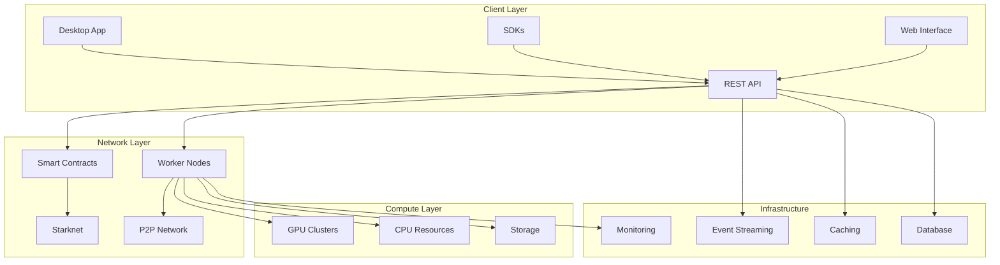

# 🌐 Welcome to CIRO Network

> **Transforming idle GPUs into a decentralized AI powerhouse**

Welcome to the comprehensive documentation for **CIRO Network**, the
next-generation Starknet-native marketplace that revolutionizes how we think
about compute resources. We're building the future where unused GPU power
becomes valuable compute infrastructure for AI applications.

## ✨ What Makes CIRO Network Special

  

    <h3>🚀 Starknet-Native</h3>
    
Built from the ground up on Starknet, leveraging Cairo smart contracts for unmatched security and scalability.

  

  

    <h3>💰 Monetize Idle GPUs</h3>
    
Transform your unused GPU power into passive income by contributing to the decentralized compute network.

  

  

    <h3>🤖 AI-Optimized</h3>
    
Purpose-built for AI workloads with specialized compute engines and efficient resource allocation.

  

  

    <h3>🔐 Enterprise-Grade</h3>
    
Production-ready security, monitoring, and reliability features for mission-critical applications.

  

## 🎯 Quick Navigation

**New to CIRO Network?** Start with our
[Getting Started Guide](./getting-started/what-is-ciro.md) to understand the
basics and get up and running quickly.

**Want to contribute compute power?** Check out our
[GPU Owners Guide](./user-guides/gpu-owners/becoming-worker.md) to learn how to
monetize your idle GPUs.

**Building dApps?** Explore our
[Developer Documentation](./user-guides/developers/using-compute.md) to
integrate CIRO compute into your applications.

**Curious about the architecture?** Dive into our
[Technical Architecture](./architecture/system-overview.md) to understand how
everything works under the hood.

## 🌟 Key Benefits

### For GPU Owners

- **Passive Income**: Earn rewards by sharing your unused GPU power
- **Easy Setup**: Simple desktop application with one-click setup
- **Automatic Optimization**: Intelligent workload distribution and resource
  management
- **Transparent Earnings**: Real-time monitoring and detailed earning reports

### For Developers

- **Scalable Compute**: Access distributed GPU power on-demand
- **Cost-Effective**: Pay only for compute you actually use
- **Developer-Friendly**: Comprehensive SDKs and APIs
- **Reliable Infrastructure**: Built for production workloads

### For Enterprises

- **Private Networks**: Deploy dedicated compute clusters
- **SLA Guarantees**: Service level agreements for critical applications
- **Compliance Ready**: Security and audit features built-in
- **24/7 Support**: Enterprise-grade support and monitoring

## 🏗️ Architecture Overview

CIRO Network consists of several key components working together:

## 🚀 Getting Started

Choose your path to get started with CIRO Network:

  

    <h3>🖥️ GPU Owners</h3>
    
Ready to monetize your idle GPUs? Get started with our desktop application.

    <a href="./user-guides/gpu-owners/becoming-worker.md" class="btn btn-primary">Start Earning →</a>
  

  
  

    <h3>👨‍💻 Developers</h3>
    
Build powerful AI applications with decentralized compute resources.

    <a href="./user-guides/developers/using-compute.md" class="btn btn-primary">Start Building →</a>
  

  
  

    <h3>🏢 Enterprise</h3>
    
Scale your AI infrastructure with enterprise-grade solutions.

    <a href="./user-guides/enterprise/solutions.md" class="btn btn-primary">Learn More →</a>
  

## 🤝 Community & Support

Join our vibrant community of developers, GPU owners, and AI enthusiasts:

- **Discord**: Real-time chat and community support
- **GitHub**: Open source development and issue tracking
- **Developer Forum**: Technical discussions and Q&A
- **Documentation**: Comprehensive guides and API references

## 📈 Network Statistics

  

    <h4>Active Workers</h4>
    
Coming Soon

  

  

    <h4>Total Compute Hours</h4>
    
Coming Soon

  

  

    <h4>Network Hashrate</h4>
    
Coming Soon

  

  

    <h4>Rewards Distributed</h4>
    
Coming Soon

  

## 🔗 Quick Links

- **[GitHub Repository](https://github.com/Ciro-AI-Labs/ciro-network)**: View
  the source code and contribute
- **[Official Website](https://ciro.network)**: Learn more about CIRO Network
- **[Starknet Explorer](https://starkscan.co)**: View network activity and
  transactions
- **[Status Page](https://status.ciro.network)**: Monitor network health and
  uptime

---

📝 Documentation Status

This documentation is actively being developed. Some sections may be incomplete or subject to change. We appreciate your patience as we work to provide comprehensive documentation for all aspects of CIRO Network.

💡 Feedback Welcome

Found an issue or have suggestions? We'd love to hear from you! Please <a href="https://github.com/Ciro-AI-Labs/ciro-network/issues">open an issue</a> or contribute directly to the documentation.

---

_Ready to dive in? Start with our
[Quick Start Guide](./getting-started/quick-start.md) and begin your journey
with CIRO Network today!_
