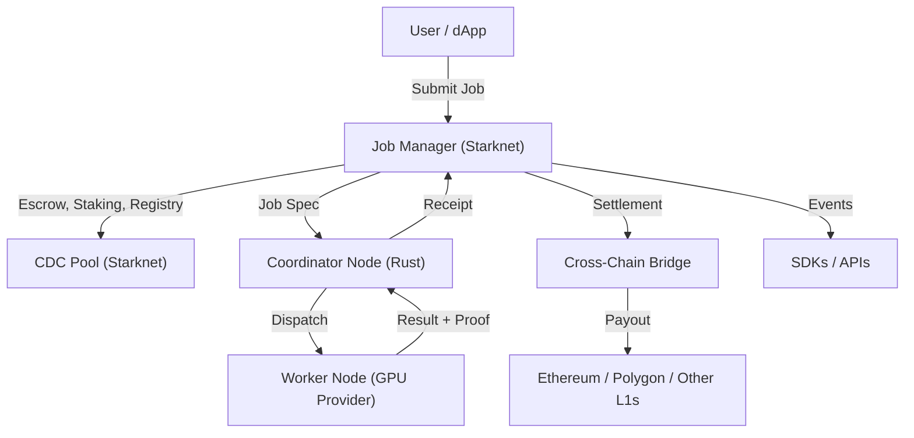

# 🛠️ System Overview

Welcome to the Ciro Network technical overview! Whether you’re a developer, researcher, or just curious about how it all works, this page will give you a clear, high-level understanding of our architecture and core components.

---

## 🌐 What is Ciro Network?

Ciro Network is a decentralized, multichain compute layer that connects GPU providers with users who need verifiable, high-performance AI and data jobs. It combines smart contracts, distributed nodes, and cryptographic proofs to deliver trustless compute—open to all.

---

## 🏗️ High-Level Architecture

---

## 🧩 Core Components

- **Smart Contracts (Starknet, Multichain)**
  - Job Manager: Escrow, staking, job registry, slashing
  - CDC Pool: Compute rewards, performance tracking
  - Governance Treasury: DAO, multi-sig, timelock
  - Bridges: Cross-chain settlement and staking
- **Coordinator Node (Rust)**
  - Batches jobs, dispatches to workers, submits receipts
  - Handles network health, reputation, and job allocation
- **Worker Nodes (GPU Providers)**
  - Run AI/data jobs, generate cryptographic proofs (ZK-ML)
  - Stake CIRO tokens, earn rewards, report performance
- **Bridges & Multichain Settlement**
  - Settle jobs and staking on Starknet, Ethereum, Polygon, and more
  - Bridge results and funds across chains
- **SDKs & APIs**
  - JavaScript, Python, and multi-chain SDKs for easy integration
  - CLI and web UI for job submission and monitoring

---

## ✨ Key Features

- **Verifiable Compute**: ZK-ML proofs for trustless results
- **Multichain Settlement**: Pay and stake on your preferred chain
- **Staking & Slashing**: Economic security for users and providers
- **Open Participation**: Anyone can join as a user or provider
- **Decentralized Governance**: DAO, multi-sig, and timelock controls
- **Performance Bonuses**: Rewards for uptime, speed, and zkML jobs

---

## 🔄 How It All Fits Together: Job & Settlement Flow

1. **User submits a job** (AI inference, data processing, etc.) via SDK, CLI, or web UI
2. **Job Manager contract** escrows payment, checks staking, and registers the job
3. **Coordinator node** batches and dispatches the job to available worker nodes
4. **Worker node** runs the job, generates a cryptographic proof, and returns the result
5. **Coordinator submits receipt** to the Job Manager
6. **User retrieves results** and proof; payment is released to the provider
7. **Settlement**: Funds and rewards can be bridged to Ethereum, Polygon, or other chains as needed

---

## 📚 Learn More
- [Smart Contracts Deep Dive](../developers/contracts.md)
- [Coordinator Node Architecture](../architecture/coordinator.md)
- [Staking & Tokenomics](../tokenomics/overview.md)
- [zkML & Proofs](./zk-ml.md)
- [Multichain & Bridges](../architecture/bridges.md)
- [Getting Started Guides](../getting-started/README.md)

**Have questions?** Join our [Discord](https://discord.gg/ciro-network) or check out the rest of the docs for more details!
