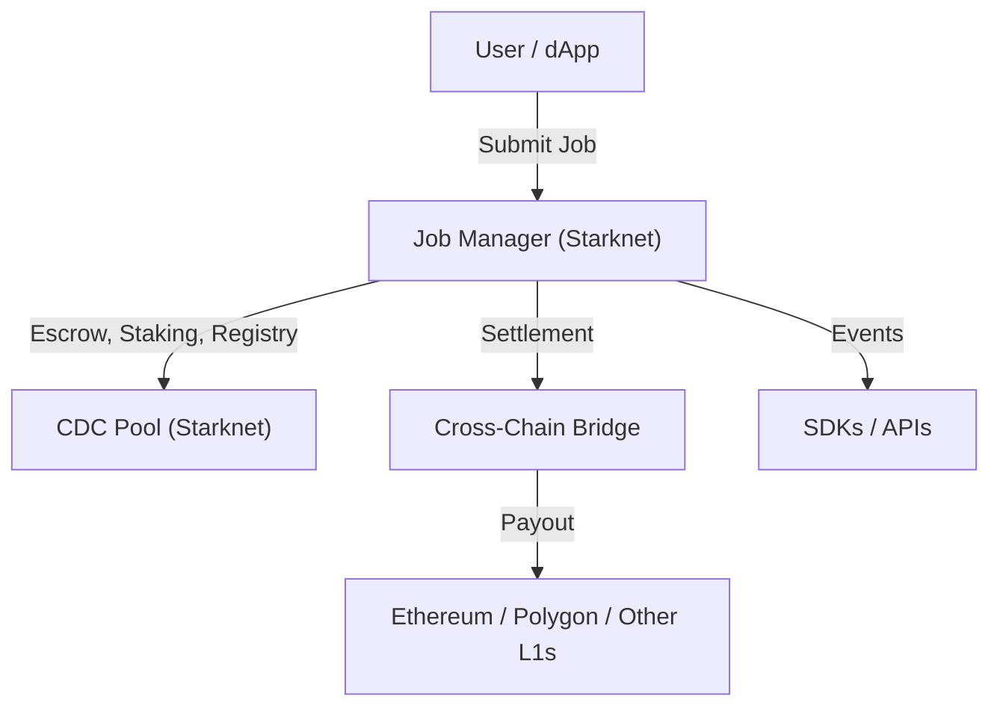

# 🟣 Starknet & Cairo: Our Foundation

Welcome! If you’re curious why Ciro Network is built on Starknet and Cairo, this page is for you. Here’s how these technologies power our vision for open, verifiable compute.

---

## 🤔 What is Starknet? What is Cairo?

- **Starknet** is a next-generation, zero-knowledge (ZK) Layer 2 network for Ethereum. It brings massive scalability, low fees, and strong security—while keeping everything provable and open.
- **Cairo** is the programming language for Starknet smart contracts. It’s designed for ZK proofs, enabling complex logic and cryptography to run efficiently on-chain.

---

## 🚀 Why Did Ciro Choose Starknet & Cairo?

- **Verifiability:** Starknet’s ZK tech lets us prove every job, payment, and stake is correct—on-chain, for anyone to check.
- **Scalability:** Handle thousands of jobs per second, with low fees and fast finality.
- **Security:** Inherits Ethereum’s security, with extra protection from ZK proofs.
- **Innovation:** Cairo enables advanced features (ZK-ML, upgradability, multichain bridges) that aren’t possible on older chains.
- **Community:** Starknet is open, fast-growing, and developer-friendly—perfect for a global, collaborative project like Ciro.

---

## ⚙️ How Does Ciro Use Starknet?

- **Smart Contracts:** All core logic (job management, staking, rewards, governance) lives on Starknet, written in Cairo.
- **Settlement:** Jobs and payments are settled on Starknet, with bridges to Ethereum, Polygon, and more.
- **ZK-ML Proofs:** Starknet verifies cryptographic proofs of AI jobs, making results trustless and transparent.
- **Multichain:** Starknet acts as the “hub” for Ciro’s multichain architecture, connecting to other L1s and L2s.

---

## 🏗️ Visual: Ciro on Starknet

---

## 🌍 Real-World Impact
- **AI for DeFi:** Trustless oracles and risk models, secured by ZK proofs
- **Open Compute:** Anyone can join, earn, and verify results—no gatekeepers
- **Enterprise-Ready:** Auditable, compliant, and scalable for real-world use
- **Global Collaboration:** Developers, providers, and users from every continent

---

## 📚 Learn More
- [Starknet Official Docs](https://docs.starknet.io/)
- [Cairo Language](https://www.cairo-lang.org/)
- [Ciro Smart Contracts](../developers/contracts.md)
- [System Overview](./overview.md)
- [Getting Started Guides](../getting-started/README.md)

**Questions?** Join our [Discord](https://discord.gg/ciro-network) or explore the rest of the docs for more details!
