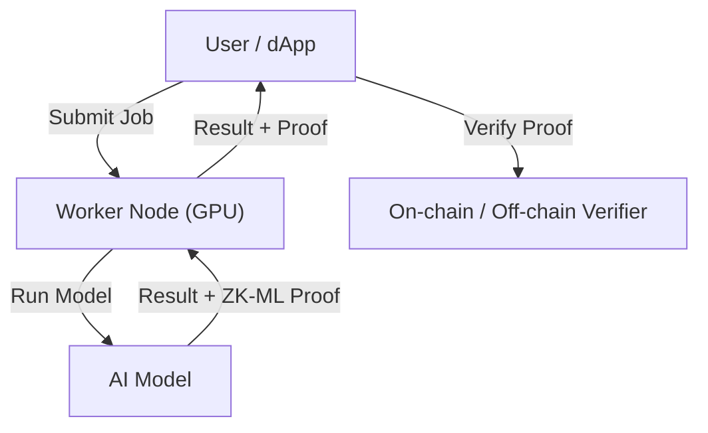

# ✨ The Magic of ZK-ML

Welcome! If you’ve ever wondered how Ciro Network can guarantee the results of AI jobs—without trusting any single party—this page is for you. Here’s how Zero-Knowledge Machine Learning (ZK-ML) makes it possible.

---

## 🤔 What is ZK-ML?

**ZK-ML** stands for **Zero-Knowledge Machine Learning**. It’s a breakthrough technology that lets someone prove they ran an AI model correctly—**without revealing the model’s secrets or the raw data**.

- **Zero-Knowledge Proofs (ZKPs):** Cryptographic techniques that prove a statement is true, without revealing *why* it’s true.
- **ZK-ML:** Applies ZKPs to machine learning, so you can prove “I ran this model on this data and got this result”—and anyone can verify it.

---

## 🔒 Why Does It Matter?

- **Trustless Results:** No need to trust the GPU provider, the network, or even the model creator. The proof is math.
- **Privacy:** Sensitive data and proprietary models stay private—only the result and proof are shared.
- **Verifiability:** Anyone (users, dApps, smart contracts) can check the proof and know the result is correct.
- **New Use Cases:** Enables DeFi, DAOs, and on-chain games to use AI safely and transparently.

---

## ⚙️ How Does Ciro Use ZK-ML?

1. **User submits a job** (e.g., image recognition, risk scoring)
2. **Worker node** runs the AI model on their GPU
3. **Worker generates a ZK-ML proof** that the computation was done correctly
4. **Proof and result** are sent back to the user (and optionally, on-chain)
5. **Anyone can verify** the proof—on Starknet, Ethereum, or other chains

### 🛠️ Under the Hood
- Ciro integrates with leading ZK-ML frameworks (Orion, Giza, RISC Zero, etc.)
- Proofs are generated off-chain (on the worker’s GPU/CPU)
- Verification can happen on-chain (Starknet) or off-chain (SDK, API)

---

## 🖼️ Visual: ZK-ML Job Flow

---

## 🌍 Real-World Examples
- **DeFi Oracles:** Prove an AI model generated a price feed, without revealing the model or data
- **On-Chain Games:** Prove a game AI made a move fairly, without leaking strategy
- **Enterprise AI:** Prove compliance or auditability for sensitive predictions
- **Research:** Share results with cryptographic guarantees, protecting IP and privacy

---

## 📚 Learn More
- [ZK-ML Research](https://zkml.community/)
- [Ciro Smart Contracts](../developers/contracts.md)
- [Job & Proof Flow](./overview.md)
- [Getting Started Guides](../getting-started/README.md)

**Questions?** Join our [Discord](https://discord.gg/ciro-network) or explore the rest of the docs for more details!
